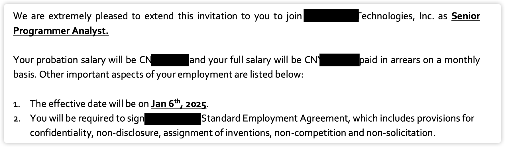

不是标题党, offer 为证，已入职一年有余

作为一个工作 N 年的职场人，入职外企一年后才明白进入外企非常简单，靠交叉能力即可（专业 + 英语）

在参与招聘的过程中，**发现咱们国人的交叉能力之弱**，属实让我震惊。现在回头来看，我就是误打误撞按照这个方法，进入外企，成为了上四休三、20 天年假的幸运儿

{/* truncate */}

### 进入外企的两个必要条件?

- 外企在招人
- 能力满足岗位要求

你可能会想"这不是废话嘛，还用你说"。 是，这就是一个正确的废话，这恰恰也是进入外企最本质的两个条件

请让我解释一下，应该怎么依据这两个条件，做有效努力，进入外企

### 外企在招人

毋容置疑，对方不招人，你就算是马云/马化腾也进不去

你可能会有一些疑惑

- 我所在的城市没有外企，怎么办? 
- 有外企但没在招人，怎么办?
- 外企在招人，但不是我的岗位，怎么办?

办法很简单，就是你入职的外企不一定在你所生活的城市

What 什么?

大家都听说过外企友好的居家办公制度吧(WFH，work from home)。 对，聪明的你可能已经明白啦，**完全可以入职一个外地的外企，然后居家办公**

为了证明这个方法的可靠性， 给大家分享个鬼故事: 

> 我入职一年多，有个同事到现在还没见过面。事情是这样的，他面试时就和 leader(领导) 沟通好，采取居家办公的工作模式。我们 leader 当然同意呀，因为就很多同事人在济南，也不来公司办公

### 能力满足岗位要求

什么是满足要求？

**能力满足 = 英语够用 + 专业能力合格**

以程序员岗位为例，英语再好不会写代码也白搭，反之依然

- 英语够用的意思是，**你不需要把英语说的像母语(native speaker)一样好，能沟通清楚工作内容就行**
- 专业能力合格的意思是，你不需要会造火箭，只要能把活干出来就行

借用著名相声演员冯巩话，"我是说相声中演小品最好的，演小品中说相声最好的"，这是他功成名就的交叉能力。而我们入职外企的交叉能力就是英语 + 专业知识

分享我司刚发生的一个案例，让大家看看交叉能力在当前社会有多稀缺

> 前几天，美国总部要求中国团队写一封《为什么 2 个月也没招到QA(测试工程师)》的报告。事情是这样的，去年 12 月份我司新出来一个 QA 的名额，经过了紧锣密鼓的招聘，结果居然是没没招到
>
> 济南，951 万人，一个虹吸周边城市人才的省会，居然找不出来一个符合的人。真的不是我司要求高，像我这种专科毕业，从来没进过大厂，连中厂的 offer 都没收到过的菜鸟都能通过面试

感谢各位朋友放弃竞争，才让我成为那个上四休三、年假 20 天的幸运儿，这里是不是应该磕一个？

### 我就想知道英语需要学到什么程度?

**学完《新概念英语 1 册》的第 55 课（一共 144 课）**

Why 为什么? 

因为我就是学到第 55 课通过面试的

就这么简单? 

好吧，其实是有亿点点曲折的，我是 3 年面了 3 次才通过

- 第一次: 啥也没准备，去面试，没通过
- 第二次: 学了两年半英语，去面试，没通过
- 第三次: 学习《新概念》半年后，去面试，通过

在第二次还没通过后，我就知道学习方法一定出问题了，所以我花 4000 大洋报了一个在线的英语辅导班。 交钱了，你就会有真正老师的联系方式啦（之前的都是销售人员给你吹课程多牛），然后我争取到一次一对一的咨询机会

老师的结论是，我英语还是小学水平，连上他的课最低标准都没到。先给我保留名额，把《新概念 1 册》学完后再来

~ 此处省略了吐槽销售人员的 1 w 字 ~

说一下我在学新概念前的水平吧，给大家做一个参考

- 英语能得多少分，全靠选择题能蒙对几个
- 没过英语四级，其实是连备考的勇气都没有
- 英语课从来没听过，都是在学其他科目
- 前两年半是用可理解输入的方式学习的，就是看美剧/看电影 (说实话哈，屁用没有)

你可能会认为我已经在外企一年， 英语很厉害了吧

在我不断努力下，终于学到了第 88 课

辅导班已经交钱两年啦，现在还没开始上课...

恭喜你，**现在你得到了一个价值 4000 元的英语学习方法**

专业能力不用讨论，因为经过国内企业的"充分锻炼(牛马工作)"，在外企干活绰绰有余

### 外企是一个机会均等的雇主

我为什么会说这是一个人人都能用的方法，**因为外企用人选拔是机会均等的**

什么叫机会均等？

- 不看学历，有没有学历都行，别说专科了
- 不看年龄，不卡 35 岁，年龄大我们认为经验更丰富
- 不看性别，不在乎你是不是育龄女性
- 不看健康情况，有残疾证好像还优先录取呢

### 我是大学生怎么办?

听大哥一句劝，一定要考四级。考不过也没关系，只要你敢参加考试，就已经满足要求

另外，我司有很多岗位是只招实习生的。实习生就是一张白纸，好教，听话，不像我们这种老油条心里小九九太多

弟弟妹妹们，你们可能不了解外企的制度，我列举一下相对于某些企业的优点吧（鸡汤模式启动~）

- 入职就有每年 12 天年假，逐年递增，最高 20 天
- 孩子 3 岁以内，每年 10 天育儿假
- 父母 60 岁以上，每年 10 天护理假
- 生日月 1 天生日假
- 加班得申请，因为加班就要付给你 2 倍，3 倍的薪水

对了，以上都是**带薪休假。并且像年假那种，你必须休，不休不行**（法律规定， 外企非常在乎合法合规）

### 外企有缺点吗

- 工资不高，如果你能进 BAT 大厂，请慎重考虑
- 外地外企：社保只能交企业所在地的，可能你在医院报销不那么方便
- 外地外企：同事关系可能没那么近，不过这重要吗

### 咱们头脑风暴一下

- 爱玩游戏 + 英语 = 游戏测试工程师
- 编程能力 + 英语 = 程序员
- 测试能力 + 英语 = 测试人员
- 某种能力 + 英语 = 海外企业在华的天选之子
- 语言 1 + 语言 2 = 翻译人员（大点的外企都需要的）

人事，出纳，会计，产品经理，运维等，正常企业有的岗位外企都有，只需要你现在的能力 + 英语就可以入职外企啦

该说再见了，断断续续改了 5 天，想说的话太多，但精力有限，请关注我就可以及时收到最新分享

你如果认为该文章能帮助到你的某个朋友，请转发给他/她

**你如果认为该文章有对你有帮助，请点个赞/推荐，这是对我的最大鼓励**
