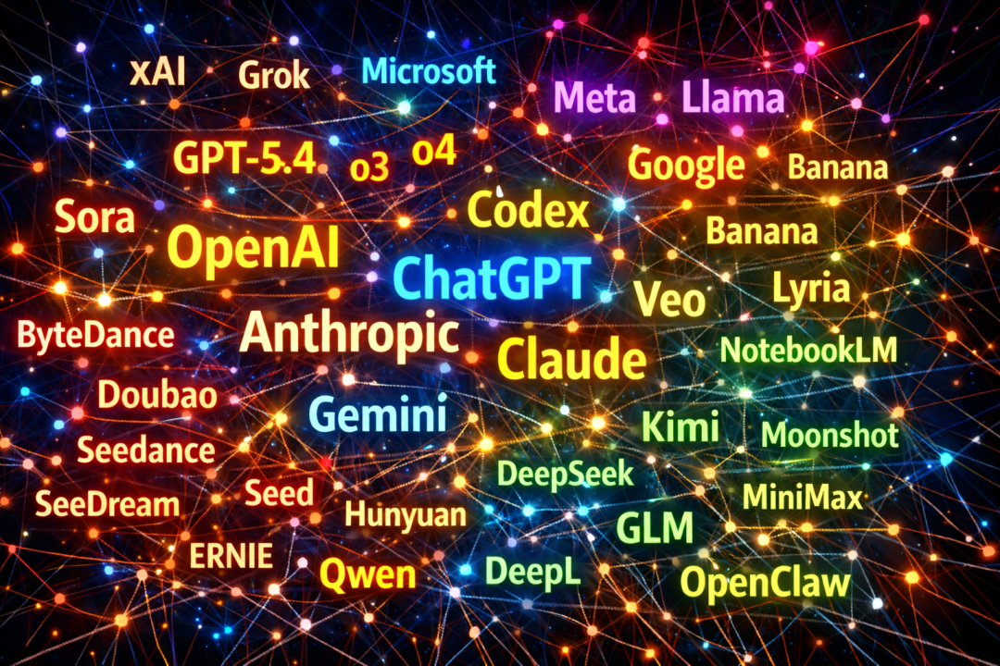
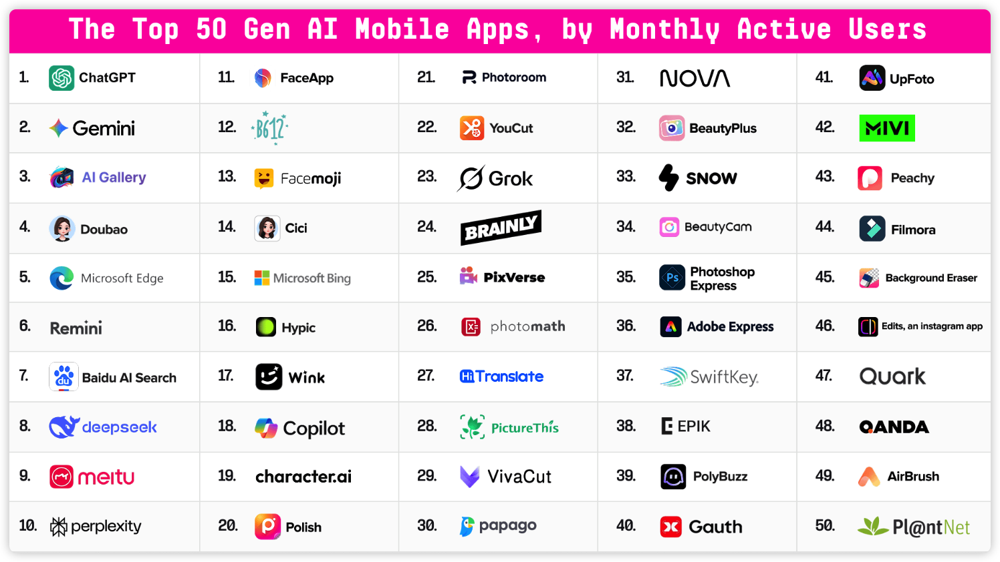
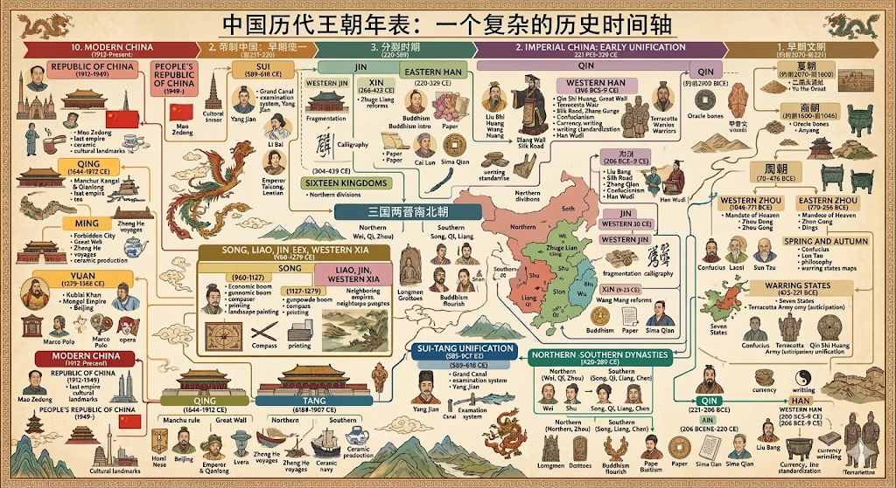
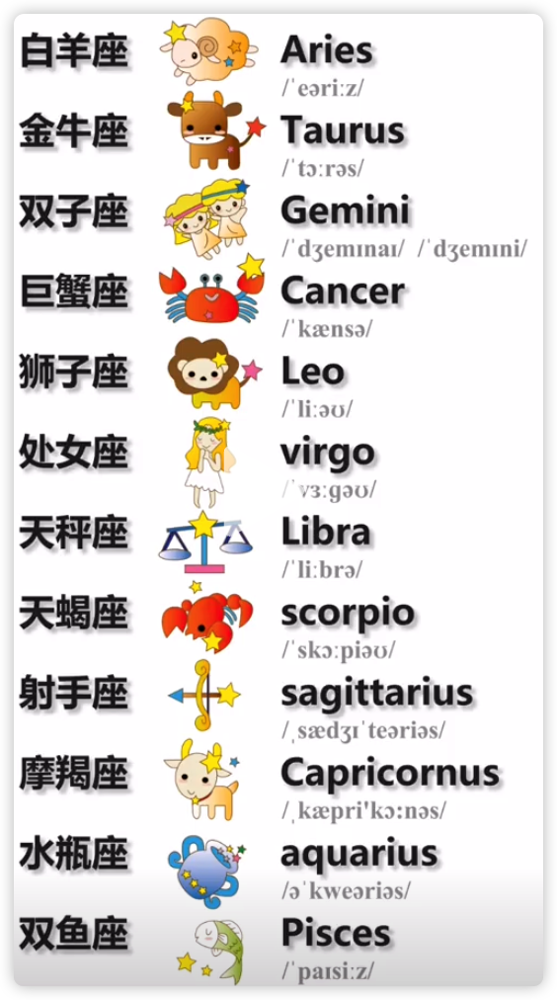
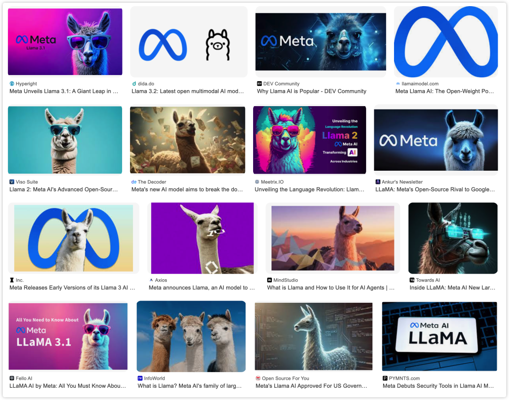
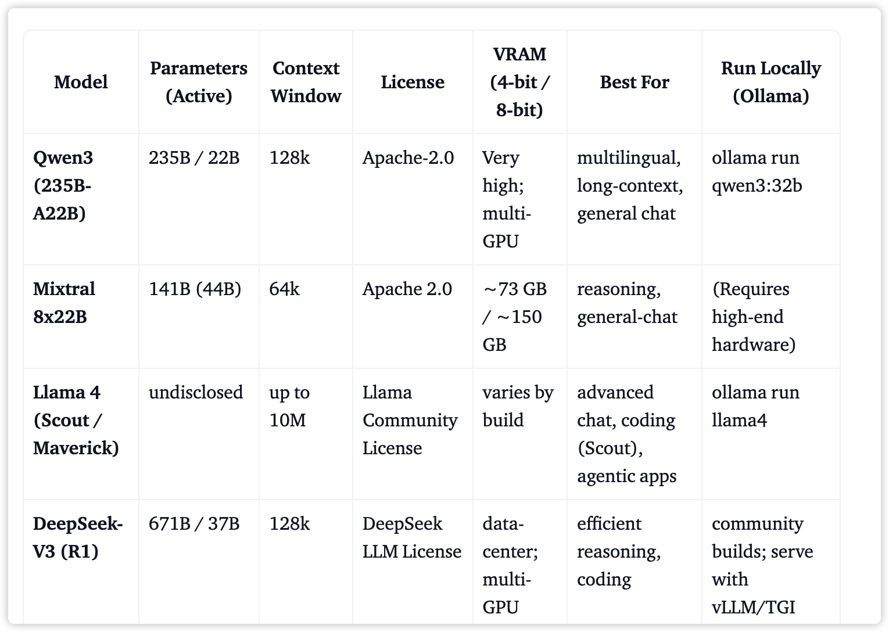
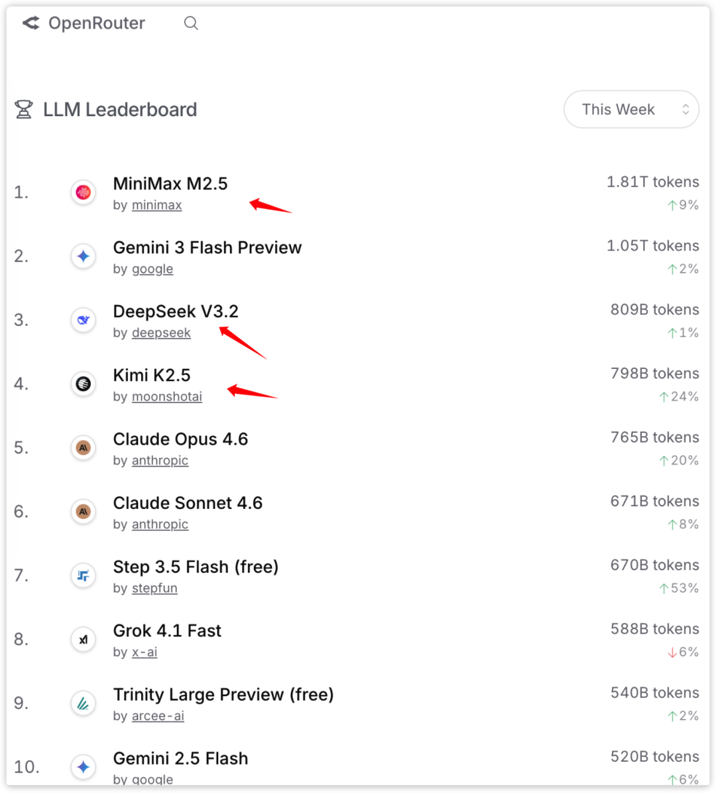
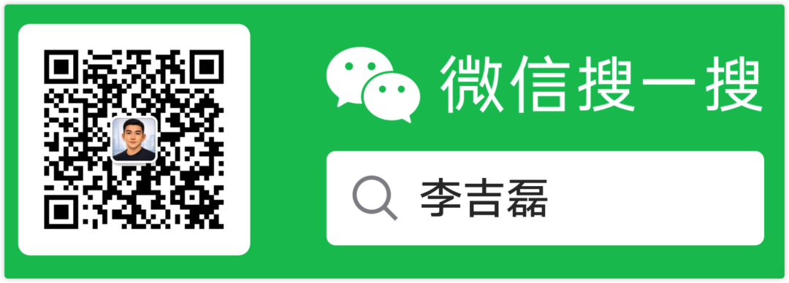
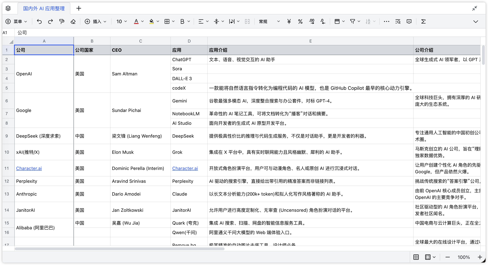

你是否也有这样的困惑

- Anthropic 和 Claude 是啥关系？
- ChatGPT 和 GPT 到底啥区别？ o3, o4 又是个啥?
- OpenClaw 在 AI 时代的产品定位是什么？

我也有类似困惑

于是我以著名投研机构 a16z 的 AI 应用排行榜为基础, 理清市面了主要公司、产品与模型之间的关系

整理成文, 以飨诸君

{/* truncate */}

为了避免概念混乱，标题使用同一结构：公司 → 产品 → 模型

举个栗子: 

> 阿里巴巴 → 淘宝 → 支付宝/各个快递/阿里云
>
> **阿里巴巴**这家公司, 做了一个叫**淘宝**的产品, 背后是**阿里云/支付宝/各家快递**提供的支撑

此外，为了更好认清 AI 行业, 我又区分了国内/外厂商(其实就是中美两家啦)

## 一、国外厂商

### 1. OpenAI → ChatGPT → GPT

- 产品：ChatGPT、Sora、Codex
- 模型：GPT-5.4、GPT-5.4-Codex、o3-pro、o4

**ChatGPT** 是 OpenAI 做的一个聊天应用, 其中文字输入输出能力由 GPT, o4 等模型提供

**Sora** 是一个生成视频的应用, 提供生成能力的模型名也是叫 Sora。最近已经被被字节出的 Seedance 2.0 生成视频模型"碾压"

**Codex** 是一个写代码的工具。如果你看到某个模型叫 GPT-5-Codex, 意思是在 GPT-5 模型基础上进行了代码能力增强

小问答: GPT 和 o 两个系列模型有什么区别?

- GPT 是全能型, 可以和它文字/语音/图片各种方式交互

- o 是专家推理型, 适合数学, 编程，任务规划等复杂场景, 同时也更贵.

### 2. Anthropic → Claude → Claude

- 公司：Anthropic
- 模型：Claude

**Claude** 模型是由 OpenAI 前员工创立，因其不认可 OpenAI 训练模型的理念而离开。OpenAI 是追求更强的 AI 能力，而 Claude 追求更安全的 AI。最近爆火的 OpenClaw 龙虾接入效果最好的模型就是 Cladue，因为代码能力它是最强的（也最贵）

这里我是不是应该陈述 (xian, bai）一下, 我司已经买了企业级的无限使用 Claude 的服务

不过，我却不高兴, 因为该服务只允许美国团队使用

小问答: Claude 安全在哪?

Claude 的理念是追求强大 AI 能力的前提是：不能让这种能力用于制造武器、散播谣言、违法乱纪或其他潜在危害人类的用途

### 3. Google → Gemini → Gemini

- 产品: Gemini、NotebookLLM、Banana
- 模型: Gemini、Gemini-image(生图模型)、Veo(生成视频)、Lyria(生成音乐)

**Gemini** 应用就是 ChatGPT 的竞品, 背后模型是 Gemini、Banana 等

**NotebookLLM** 应用在国外超火, 因为你可以扔给它一堆枯燥的 PDF 论文或财报等, 然后它能瞬间生成一段两个主持人对话的播客，把内容讲给你听。 当然，背后的模型还是 Gemini 啦

**Banana** 是最近最火的根据复杂信息生成图片的应用，你见到那种 PPT 式图片就是它生成的。如果选择模型的话，记得选择 Gemini-3-image，因为 Gemini-3-image 才是它的模型名字

小问答: Gemini 英文原意是什么? 

是 12 星座中的双子座

为啥我一个英语菜鸡也知道, 因为我司也有个系统叫 gemini, 一开始我还以为 google 在抄袭我司呢

（网图，侵删）

### 4. X → X → Grok

- 公司：X(推特), xAI
- 产品: X
- 模型: Grok

马斯克把推特改名为 X 后，他又成立了一家叫 xAI 的公司。xAI 公司做出的来模型叫 Grok, 现已内嵌到 X 中使用。类似微信中可以召唤“元宝”一样

**Grok** 优点是可以获取 X 上的最新消息, 说白了就是其他模型的联网搜索功能，不过它搜索的是 X 上的

### 5. 微软 → Copilot → GPT

- 产品： Github Copilot、Microsoft Copilot、Copilot Chat 
- 模型： GPT

模型我没写错, 微软用的就是 OpenAI 家的 GPT

为啥呢? 

因为微软是 OpenAI 的最大金主爸爸, 主打一个"我不生产模型, 我只是模型的搬运工"

小问答: Copilot 英文原意是什么?

副驾驶

顾名思义, 在微软的产品定位中，AI 是来辅助人来干活的

### 6. Meta → Manus → Llama

- 公司：Meta(原 Facebook)
- 产品: Facebook、Instagram 和 Manus
- 模型: Llama

**Manus** 就是前段时间刷屏的《Meta 花费 50 亿美元收购中国初创公司》新闻主角

**Facebook、Instagram** 这种扎克伯格管理的应用当然接入的是 Llama，和 X 接入 Grok 一个道理

**Llama** 模型值得单独说一下，它是开源的，上文写到的所有模型都是闭源的

小问答: Llama 英文原意是什么意思?

羊驼

你如果在网上看到了的羊驼标识，基本就是和 Llama 有关

## 二、国内大厂

### 1. 字节跳动 → 豆包 → Seed

- 产品: 豆包, Cici(海外版豆包), 即梦
- 模型: Seed, SeeDance(生成视频), SeeDream(生成图片)

**豆包** 大家都知道哈, 人手一个, ChatGPT 竞品, 背后提供能力的模型是 Seed, SeeDream 等

**即梦，**没听说过哈, 如果不是写这篇文章，我也没听说过。它背后就是当下正火的生成视频的模型 SeeDance 2.0。 各大博主吹的时候都是说 SeeDance 2.0 多牛逼，很少有人提“即梦”。由此可见这些名词多么混乱了吧，咱理解国内的产品、模型都一头雾水

### 2. 阿里巴巴 → Qwen → Qwen

- 产品：通义千问（Qwen）
- 模型：Qwen

来跟我念: Qian Wen，原生多模态，地表最流行的开源模型

刚才进电梯时还看到广告来着，能自动购买东西还让人挺有未来感的

小问答: Qwen 和 Llama 两个开源模型哪个更受欢迎?

Qwen

最新开源模型下载量排名如下

还有【百度→文小言→文心一言】【腾讯→元宝→混元】不再赘述，请见名知意

## 三、AI 四小龙

### 1. 月之暗面 → Kimi → Kimi

- 公司：Moonshot(英文名）

- 产品: Kimi

- 模型: Kimi, K2

以“长文本”出名, 可以把几十万字的合同、小说扔给它，它处理得井井有条

尤其是 OpenClaw 龙虾这种需要超长上下文的应用出现后, Kimi 现在就是风口上的猪，而且还在往上飞~

### 2. MiniMax → MiniMax → MiniMax

产品: MiniMax

模型: MiniMax

OpenClaw 龙虾作者推荐模型，比 kimi 飞的还高

下方是 OpenRouter API 调用排名，MiniMax 一骑绝尘

小问答: MiniMax 的中文名叫什么?

稀宇

个人认为这家公司在品牌辨识度上做的很好，海内外都是宣传 MiniMax，降低用户心智成本。并且该公司 70% 营收都来自海外，是一家很能打的好企业

### 3. DeepSeek → DeepSeek → DeepSeek

- 公司：DeepSeek（深度求索）
- 产品：DeepSeek
- 模型：DeepSeek

**DeepSeek** 和 ChatGPT 是竞品，感觉现在知名度和 ChatGPT 一样, 全球没有人不知道的

感谢这些行业“搅屎棍”的出现，类似模型质量的情况下，价格是同行的 1/10, 没有它我们还用不到如此便宜的 AI 服务

### 4. 智谱 → z.ai → GLM

- 产品: z.ai
- 模型: GLM

它的知名度可能不如上面三家大, 这不代表 GLM 模型就差, 因为该公司主要营收来自企业级客户

国外也有一家企业采购的首选模型，就是 Claude

> 碎碎念：我对这家企业最有感情，因为在前司第一次微调的模型就是 ChatGLM-3-6B。 并且最终还上线了生产环境，给公司 10 亿营收贡献了亿点微薄之力。
>
> 在此，也感谢当时 leader 给的机会，让我一个 CRUD 程序员磕磕绊绊蹬上了 AI 这条船

## 四、垂类神仙：术业专攻

### 1. Midjourney

生图模型

网上那些非常逼真，艺术感极强的图片，大概率是出自该模型

### 2. DeepL

双语翻译模型

第一个把机器翻译翻出“人味”的模型，因为市面上很高频出现，故在此解释

## 龙虾

### OpenClaw 龙虾

夸张一点说就是《钢铁侠》电影中的贾维斯，一个有收到任务后能自己完成工作的助理

我在 1 月底，OpenClaw 在 X 上爆火时尝试用过，我感觉就是坨 Shit

- 用的 token 贼多
- 不能主动停止任务
- 不显示任务执行状态、进度
- 代码有很大优化的空间
- 他能干的活，我写代码都能实现

但它现在这么火让我又产生了 fomo (害怕错过) 心态，因为根据索罗斯的反身性原理它的发展会超乎我的认知。现在业界都在共建其的生态，OpenAI 还收编了创始人，所以它可能会成

但我不看好它，个人认为，它会被完全推倒重写，只保留 OpenClaw 这个名字。 像“我的世界”游戏第一版用 Java 写的，被微软收购后用 C++ 重新实现

> Q: 什么是反身性原理？
>
> A：大家认为你行时，不行也行；大家认为你不行时，行也不行

我尽量把关系写的分门别类、井井有条，但总觉得没有学习时整理的思维导图清晰明了。 如果你不嫌弃的话，可以公众号给我私聊，我发 Xmind 原文件给你

另外，我还开源了 a16z 应用榜单中所有应用的原始调研数据，包含公司介绍，应用介绍，创始人，归属国家放到了飞书文档上，请点击"阅读原文"获取

真·开源 = 可编辑，可下载，可复制，现在只是个 demo, 邀请大家共建

Hi, 朋友, 我想对我写的内容负责, 但无奈平台太多, 无法一一兼顾. 故想了一个办法, 文章讨论请移步同名公众号. 

每个人都有微信, 大家可以集思广益, 从留言中获取最新信息, 寻找同道众人. 我可以集中回复, 纠正错误内容, 更新最新信息等

给公众号发送"002"后, 即可直达该文章评论区

如果认为该文章有对你有帮助，请点赞/推荐，这是对我的最大鼓励
