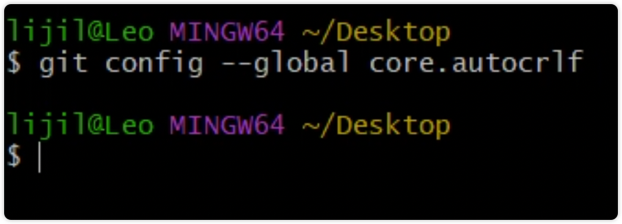
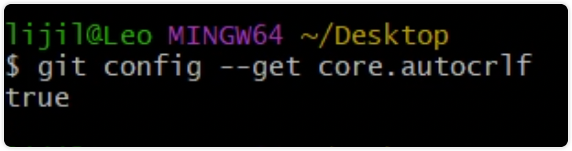
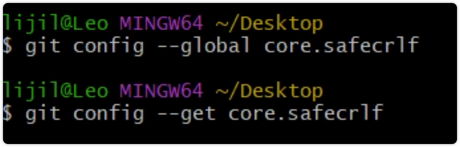

执行下方这条命令即可

```sh
git config --global core.safecrlf=false
```
{/* truncate */}

我知道你现在很着急, 抓紧去 commit 吧

如果还不行, 你就把上面命令中的 safecrlf=false 改为 autocrlf=true, 再执行一次

全文完

---

如果你满肚子都是疑问请往下看

### 为什么会出这个问题?

我敢拿生命保证, **你肯定在用 Windows, 这是 Windows 专属 bug** 

(换成 MacOS 也能彻底解决这个问题)


### 为什么我同事也都是 Windows 却没问题?

是因为你某次不经意的操作把 git 中的 safecrlf 配置改成了 true

- 可能是某个软件"好心"帮你改的
- 可能是你之前看到某篇文章说 `safecrl=true` 是最佳实践, 然后你就改了

而 Git 的默认配置就是 false, 文章开头那个命令就让你改回去而已


如果你想了解到底为什么, 请坐好, 要发车了


### 什么是 LF & CRLF

世界上有两种操作系统

- Windows
- Unix = MacOS + Linux

这两种系统在表示`空格`这种不可见字符时方式是一样的, 但表示`到这该换行啦`的方式却不一样

- Windows 用 `CRLF` 标识
- Unix 用 `LF` 标识

问题此时就出现了, 怎么保证代码/文本在任何系统上都能正常显示/运行呢?

Git 给出了解决方案: 只用 LF. 

如果是 Windows 系统

- 在从仓库拉取代码时(其实是把代码 checkout/switch 到某分支时)自动把 LF 转换成 CRLF
- 在 add 时自动把 CRLF 转换成 LF

这种行为是由那个配置项控制的呢?

auto crlf, 看准单词, 是 **auto**. 文章最上方让你设置是另一个配置项: **safe**


### 报的错是什么意思?

fatal: LF will be replaced by CRLF

警告:  CRLF 将要转换 LF(但我就是不给转)

What?

commit 时就是应该是把 CRLF 转换成 LF, 很正常呀, 它为什么会出警告

问题出在一个叫做 `safe crlf` 的配置项上, 看准单词, 是 **safe**

这个配置项的意思是: 检查 CRLF 与 LF 的转换是否安全.

隐含意思是: 判断一下以后 checkout/switch 时还能把 LF 转换成 CRLF吗?

恭喜你, 中奖了, Git 认为以后转换不回来, 所以不让你 add 本次的变更

Fuck!

这时你需要告诉它, 不要检查, 即 safecrlf = false


### 这样改行吗?

当然行了, 这是 Git 的默认配置, 你同事在愉快的用 Windows 开发, 就是因为他们没动过默认配置

> 接下来的演示是全新系统/全新 git 的效果, 你肯定无法复现, 不过可以去你同事电脑上试试


其他文章可能会让你执行下面这个命令, 看一下是否设置了自动转换(看准单词, 是 auto)

```sh
git config --global core.autocrlf
```

执行后什么都不会显示, 类似这样



这是因为只要没配置过全局的 autocrlf, 就会显示为空

那怎么查看 auto 当前的默认值呢? 

你应该执行下面这个命令: 把单词 global 换成了 get

```ssh
git config --get core.autocrlf
```



显示 true, 意思就是 Git 默认给自动转换

你可以在你电脑上执行一下, 如果显示是 false, 抓紧执行下方命令, 改为 true

```sh
git config --global core.autocrlf=true
```


接下来同理, 我们去查看 safe 的默认值

```sh
git config --global core.safecrlf

git config --get core.safecrlf
```



你会发现这两条命令都没有结果

Why?

傻瓜, 你还没明白吗, **没有值就是 null, null 在程序中代表 false** 呀

看看这一节的标题, 你心中有答案了, 对吧


### 有些包不管任何系统, 它只用 LF

比如说 pnpm, 它不管什么系统, 都会把 package.json 和 pnpm-lock.json 的换行符格式化成 LF 的

所以, 请接受现实, 胳膊拧不过大腿, 老老实实按我说的改就行, 用节省下来的精力**去用在真正重要的技术上**不好嘛

or

**早点下班, 享受下生活**