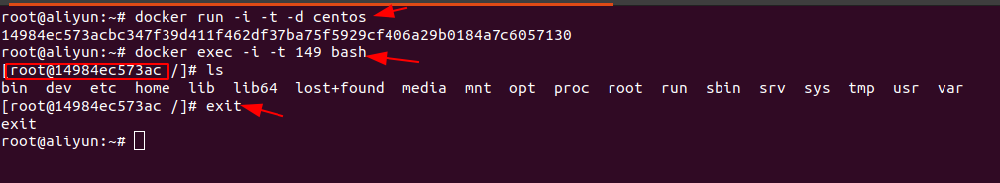
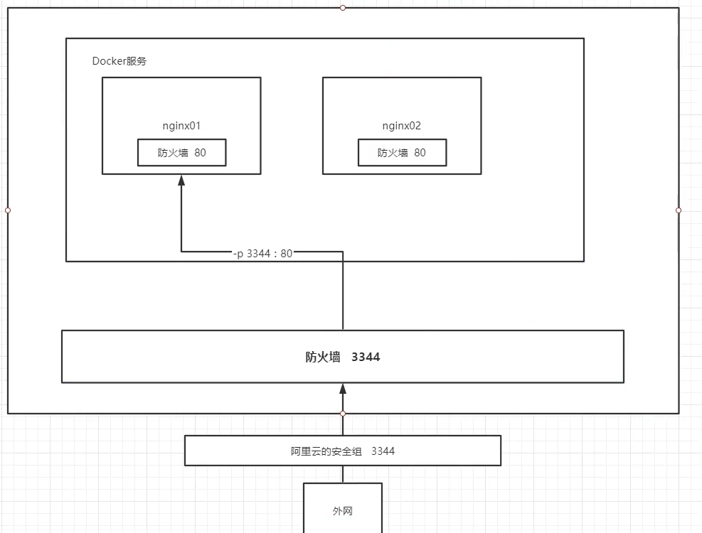

## 概述

**为什么会出现**

一款产品，开发和上线两套环境，环境配置费时费力，而且容易出问题

发布项目时，不只是一套代码过去，而是代码+环境整体打包过去

开发即运维，保证系统稳定性，提高部署效率

思想来自于集装箱，对环境进行隔离

**基本组成**

- 镜像(image)：镜像好比一个模板，可以通过这个模板来创建容器，一个镜像可以创建多个容器；**类似java一个类可以创建无数个对象**

- 容器(container)：容器可以理解为一个简易的系统

- 仓库(repository)：存放镜像的地方,分为共有仓库和私有仓库

  `应用 -> 环境（容器） -> 内核`

  

**怎么工作的？**

Docker是一个Client <—> Server结构的系统，Docker的守护进程在主机上，客户端通过Socket访问


Docker为什么比VM快？

- Docker比虚拟机更少的抽象层

- 新建一个容器时docker用的是宿主机的内核，docker不需要像虚拟机一样重新加载一个操作系统内核


|          | 传统虚拟机               | Docker        |
| -------- | ------------------------ | ------------- |
| 虚拟内容 | 硬件+完整的操作系统+软件 | APP+LIB       |
| 大小     | 笨重，通常几个G          | 轻便几个M或KB |
| 启动速度 | 慢，分钟级               | 快，秒        |

## 安装

ubuntu为例, 我只写的国内源, 让你没有出错的可能

[官方安装文档](https://yeasy.gitbook.io/docker_practice/install/ubuntu)

**卸载旧版本**

```bash
sudo apt-get remove docker \
               docker-engine \
               docker.io
```


**使用APT安装**

由于 `apt` 源使用 HTTPS 以确保软件下载过程中不被篡改。因此，我们首先需要添加使用 HTTPS 传输的软件包以及 CA 证书

```sh
$ sudo apt-get update

$ sudo apt-get install \
    apt-transport-https \
    ca-certificates \
    curl \
    gnupg \
    lsb-release
```


**设置镜像的仓库**

用国内镜像，百度搜索，docker的阿里云镜像地址

```sh
# 这是阿里云的源，不要用官方源
$ curl -fsSL https://mirrors.aliyun.com/docker-ce/linux/ubuntu/gpg | sudo gpg --dearmor -o /usr/share/keyrings/docker-archive-keyring.gpg
```

向 `sources.list` 中添加 Docker 软件源

```sh
# 这是阿里云的源，不要用官方源
$ echo \
  "deb [arch=amd64 signed-by=/usr/share/keyrings/docker-archive-keyring.gpg] https://mirrors.aliyun.com/docker-ce/linux/ubuntu \
  $(lsb_release -cs) stable" | sudo tee /etc/apt/sources.list.d/docker.list > /dev/null
```


**安装docker引擎**

```bash
$ sudo apt-get update

$ sudo apt-get install docker-ce docker-ce-cli containerd.io
```


### **启动**

> 自己备注：
>
> docker本身也是需要启动的
>
> 执行：service docker start  


```shell
# 启动
sudo systemctl start docker 

# 设置开机自启动
sudo systemctl enable docker
```


**建立 docker 用户组**

默认情况下，`docker` 命令会使用 [Unix socket](https://en.wikipedia.org/wiki/Unix_domain_socket) 与 Docker 引擎通讯。而只有 `root` 用户和 `docker` 组的用户才可以访问 Docker 引擎的 Unix socket。出于安全考虑，一般 Linux 系统上不会直接使用 `root` 用户。因此，更好地做法是将需要使用 `docker` 的用户加入 `docker` 用户组。

建

将当前用户加入 `docker` 组：

```bash
$ sudo usermod -aG docker $USER
```


退出当前终端并重新登录，进行如下测试。

```
$ docker run --rm hello-world
```


**配置阿里云镜像加速**


```bash
sudo mkdir -p /etc/docker # 创建一个陌路
------------------------------------一次命令
sudo tee /etc/docker/daemon.json <<-'EOF'
{
  "registry-mirrors": ["https://uyfgafsw.mirror.aliyuncs.com"]
}
EOF # 编写配置文件
-------------------------------------------一次命令
sudo systemctl daemon-reload # 重启服务
sudo systemctl restart docker # 重启docker
```


## 镜像命令

**镜像搜索**

```bash
docker search mysql
```

[网页版搜索地址](http://hub.docker.com)


**下载镜像**

```bash
# 下载mysql镜像，默认最新版latest
docker pull mysql 

# 下载指定版本
docker pull mysql:8  
```

```bash
[root@192 ~]# docker pull mysql
Using default tag: latest # 默认最新版
latest: Pulling from library/mysql
8559a31e96f4: Pull complete  # 分层下载
.......
Digest: sha256:8b7b328a7ff6de46ef96bcf83af048cb00a1c86282bfca0cb119c84568b4caf6 #签名
Status: Downloaded newer image for mysql:latest
docker.io/library/mysql:latest # 真实版本号
```


**查看镜像列表**

```bash
[root@192 ~]# docker image ls

REPOSITORY          # 镜像仓库源（镜像名字）
TAG                 # 镜像的版本号
IMAGE ID            # 镜像的id
CREATED             # 创建时间
SIZE                # 大小
```


```bash
root@aliyun:~ # docker images --help
Usage:  docker images [OPTIONS] [REPOSITORY[:TAG]]
Options:
	# 显示所有(在有很多镜像的情况下，只会显示前几个)
  -a, --all             Show all images (default hides intermediate images) 
  -q, --quiet           Only show image IDs      # 只显示id
```

- 加 -q 只显示id（可能也显示一部分）

- 加-a -q 显示所有的镜像的id


**删除镜像**

```bash
# 删除一个 可以通过名称，也可以指定id；删除的镜像不能有运行/停止的容器
docker image rm 9cfid前3位即可/镜像名字也行
```


## 容器命令

- 有了镜像才能创建容器
- docker容器运行必须有一个前台进程， 如果没有前台进程执行，容器认为空闲，就会自行退出。这是规定。

**根据镜像启动、进入、退出容器**

```shell
# 启动
docker run [可选参数] 镜像名字

# 启动的时候必须指定这三个参数，否则会自己关闭!!! 
docker run -i -t -d centos 

# 同时指定多个端口号绑定语法:【p 空格 p空格】
docker run -tid -p 3306:80 -p 80:81  nginx 

# 参数说明
-d 后台方式运行
-t 选项让Docker分配一个伪终端（pseudo-tty）并绑定到容器的标准输入上， 
-i 则让容器的标准输入保持打开。
-p 指定容器的端口 如-p 8080::8080（主机端口:容器端口）
```

```bash
# 进入
# 进入容器后；注意主机名，变成了centos的id
docker exec -i -t 容器id bash 
```

```bash
# 退出
exit 
ctrl + d
```

```bash
# 查看容器列表

# 查看正在运行的容器
docker container ls 

# 查看所有的容器，包括已经停止的; 还可以加-q,只显示id
docker container ls -a

Exited  关闭的
Up      在运行的
```


有很多高级的用法，启动的时候进入、后台运行、输出日志什么的。都太复杂了。

！！！我总结出来使用docker的固定步骤！！！目前知道的是redis、nginx可以，mysql需要指定参数，不可以

- 根据一个镜像启动一个容器，但不进入操作
- 进入容器
- 这样退出不会杀死这个容器




## **停止、启动、重启、删除已有容器**

```bash
 # 停止一个容器
 docker container stop id或名字(系统给的随机名字)
 
 # 启动已终止的容器 
 docker container start id或名字(系统给的随机名字)
 
 # 重启
 docker container restart id或名字(系统给的随机名字)
 
# 删除一个处于终止状态的容器（不能删除正在运行的容器）
docker container rm id或名字(系统给的随机名字)

# 删除所有终止状态的容器
docker container prune 
```

## 其他命令

```shell
docker version  		 # 显示docker的基本信息
docker info      		# 系统信息，镜像和容器的数量
docker 【命令】 --help   # 帮助信息
docker stats      		#查看所有容器的内存占用
```

**传输文件到docker容器**

```shell
都是在宿主机执行命令

Docker容器向宿主机传送文件
docker cp container_id:<docker容器内的路径> <本地保存文件的路径>
docker cp 10704c9eb7bb:/root/test.text /home/vagrant/test.txt

宿主机向Docker容器传送文件
docker cp 本地文件的路径 container_id:<docker容器内的路径>
docker cp  /home/vagrant/test.txt 10704c9eb7bb:/root/test.text
```


## 部署各种软件(请张嘴)

### 部署Nginx

```shell
[root@192]# docker pull nginx

# -p 暴露端口 3344服务器端口 : 80容器内部端口
[root@192]# docker run -d -p:3344:80  nginx 
38dbf7bdcaef232

# 使用3344可以访问成功
[root@192]# curl localhost:3344
<html>
	<head>
		<title>Welcome to nginx!</title>
	</head>
</html>
```

端口暴露



公网访问浏览器输入 192.168.147.132:3344/


**index.html路径？**
/usr/share/ngnix/html


### 安装mysql

docker run -it -p 3306:3306 -e MYSQL_ROOT_PASSWORD=密码 -d mysql:8.0.29

不这样启动，则提示需要输入密码才能启动。

不需要设置远程登陆访问，我安装上之后，在远端直接就能登陆了。


### 安装rabbitmq

admin:用户

xxx:密码

```sh
docker run -tid --hostname   my-rabbit  -p 15672:15672 -p 5672:5672 -e RABBITMQ_DEFAULT_USER=admin -e RABBITMQ_DEFAULT_PASS=xxx  rabbitmq:3.9.18
```


默认是无法访问的

进入容器：docker exec -it 1d bash

启动起来(说是在启动web页面，但是不进行这一步程序直接连也连不上)：rabbitmq-plugins enable rabbitmq_management 


**新增用户**

```sh
# 查看用户列表
rabbitmqctl list_users

# 添加用户
rabbitmqctl add_user {用户名} {密码}
# 设置用户权限: administrator
rabbitmqctl set_user_tags {用户名} {权限}

# !! 设置完权限还不行, 用户还没有查看/创建队列等权限, 也需设置
```


### 安装redis

```shell
docker run -d --name "用户名" -p 6379:6379 redis --requirepass "密码"
```


### 安装kibanna

安装 es & kibana 也是趟了不少雷, 包括**单节点启动异常、kibana 无法通信 es等**


docker run --ip http://10.168.20.82:9200 -p 5601:5601 -d kibana:8.6.1 


进入docker内部，  run kibanna-verxx-code 


### sudo 权限

想在docker容器中安装vim

- 需要在进入容器时指定为root用户, 在容器中再进行任何操作时都不需要加sudo
- 更新软件源
- 安装vim

```shell
kibana@c0f41ab4ef00:~/config$ sudo apt update
bash: sudo: command not found
kibana@c0f41ab4ef00:~/config$ exit

# root用户进入
root@node5:~# docker exec -u root -t -i c0 /bin/bash
# 再进行任何操作时都不需要加sudo
root@c0f41ab4ef00:/usr/share/kibana# sudo apt update
bash: sudo: command not found
root@c0f41ab4ef00:/usr/share/kibana# apt update
Get:1 http://security.ubuntu.com/ubuntu focal-security InRelease [114 kB]
Get:2 http://archive.ubuntu.com/ubuntu focal InRelease [265 kB]
Get:3 http://security.ubuntu.com/ubuntu focal-security/universe amd64 Packages [991 kB]
...          
# 进行安装
root@c0f41ab4ef00:/usr/share/kibana# apt install vim
After this operation, 64.7 MB of additional disk space will be used.
Do you want to continue? [Y/n] Y

```


## 卸载docker/清空间

有个服务器被同事装上了docker一顿操作, 各种镜像/容器都删了, 还占了30G空间
下方命令是我执行的, 没搞崩系统, 请放心使用

```shell
1.删除docker及安装时自动安装的所有包
apt-get autoremove docker docker-ce docker-engine  docker.io  containerd runc

2.查看docker是否卸载干净
dpkg -l | grep docker
 dpkg -l |grep ^rc|awk '{print $2}' |sudo xargs dpkg -P # 删除无用的相关的配置文件

3.删除没有删除的相关插件
apt-get autoremove docker-ce-*

4.删除docker的相关配置&目录
rm -rf /etc/systemd/system/docker.service.d
# 执行完上面的命令只清出来500M空间, 执行下方命令后直接清出来38G. 
rm -rf /var/lib/docker
```

