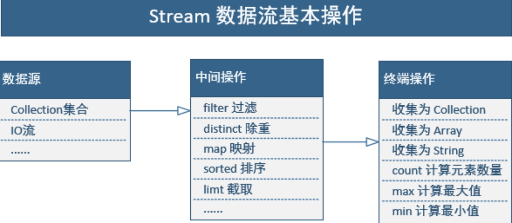

函数式编程（Functional Programming）是把函数作为基本运算单元，函数可以作为变量，可以接收函数，还可以返回函数

1. 简化代码：使用 Lambda 表达式/函数式接口/方法引用可以大大减少代码量和模板代码
2. 更灵活：函数式编程的设计思想与设计模式类似，更关注接口设计和抽象，而不是细节实现，这样可以让代码更加灵活和可扩展。
3. 更易测试：函数式编程的代码具有良好的单元测试能力，因为它关注于输入和输出之间的映射关系，并且不会与外部状态产生关联。


## lambda

Lambda 表达式，也叫闭包(js中的一个概念)，新特性：可以把函数(方法)当做一个参数传入方法并使用。
格式同js的箭头函数一样
参数和返回值均可由编译器自动推断

**@FunctionalInterface**
只有一个抽象方法的接口就可以作为lambda表达式用的接口
加上此注解就像@Override一样，不加也能用，加上就是接口出现两个抽象方法时就会报错。jdk中的所有相同作用的接口都加上了该注解

```java
@FunctionalInterface
interface NumberInterface {
    int operate(int a, int b);
}
```


```java
public class Tester {
   public static void main(String args[]){
      // 正常subtraction变量需要用一个Interface的实现类赋值给它才行
     // () -> 这一部分叫做lambda表达式，jdk8的变化就是可以不用实现类了(or 匿名内部类)，直接写的就是【入参 -> 方法体】部分，这样代码相对于以前就非常简洁了
     // 好处：少写了一个实现类
      NumberInterface subtraction = (a, b) -> a - b;
  		// 就是正常的new 对象，调方法
      Tester tester = new Tester();
      System.out.println("10 - 5 = " + tester.operate(10, 5, subtraction));
   }

   // 这个方法和正常的一样，第三个参数是接口，面向接口开发
   // 不过实际的入参是lambda表达式进来
   private int operate(int a, int b, NumberInterface numberInterface){
      return numberInterface.operate(a, b);
   }
}
```


**真实代码**

```java
// 这是jdk中开启新线程的一个接口
@FunctionalInterface
public interface Runnable {
    public abstract void run();
}
```

```java
public static void main(String[] args) {
   // 这是匿名内部类(接口)的写法，想较于以前需要写一个新类并 extends Thread，再放进来已经算是简洁了
    Thread t = new Thread(new Runnable() {
        @Override
        public void run() {
            System.out.println("新线程");
        }
    }).start();
    // 这是lambda写法，没有参数，直接写方法体
    new Thread(() -> System.out.println("新线程")).start();
}
```


**真实代码2**
这是项目中封装的redis锁框架

```java
-------------- 函数式接口 -------------
@FunctionalInterface
public interface DoInterface {
    void execute();
}    
------------- 框架中：用函数式接口的地方 ------------
		/**
     * 获取一把锁，执行function，释放锁
     *
     * @param lockKey  锁的key
     * @param function 执行方法
     */
    public static void lockDo(String lockKey, DoInterface function) {
        // 传进来是个lambda表达式，在这里面就直接.execute()就是调用啦
        function.execute();
    }

-------------- 业务代码中：----------------
        RedisLock.lockDo("keyXxxxx", () -> {
            			// 锁上之后需要执行的逻辑
            }
        });
```


**方法引用**

两类方法：
静态方法
实例方法(对象调的方法)：调用时总是有一个隐含参数this, 第一个参数：this

所谓方法引用，是指如果某个方法签名和接口恰好一致，就可以直接传入方法引用。就是避免写重复代码
方法引用，顾名思义，引用某个已经存在的方法

```java
    public static void main(String[] args) {
        String[] array = new String[] { "Apple", "Orange", "Banana", "Lemon" };
        // 以前的写法
      	Arrays.sort(array, Comparator<String>() {
            @Override
            public int compare(String s1, String s2) {
                return s1.compareTo(s2);
            }
        });
      
        // 简化成lambda表达式写法，
        // 要一个入参：两个字符串；方法体：xx.compareTo(xx); 返回值：int
        Arrays.sort(array, (o1, o2) -> o1.compareTo(o2) );
      
      Comparator<String>接口中定义的方法是int compare(String, String)
      静态方法int cmp(String, String) 也是这样
      两者方法签名一样，方法参数一致，返回类型相同
      // 这种情况下可以用方法引用，即引用一个已经存在的方法
        Arrays.sort(array, Main::cmp);
      
      // 这样也行。因为String的该方法，有一个隐含的this参数，也就相当于有两个参数了，相当于public static int compareTo(String this, String o);
      Arrays.sort(array, String::compareTo);
    }

    static int cmp(String s1, String s2) {
        return s1.compareTo(s2);
    }
```


**构造方法的方法引用**

```java
@FunctionalInterface
public interface Function<T, R> {
	R apply(T t);
}
```

`Function<T, R>` 是一个在JDK8引入的函数式接口(里面只有一个抽象方法)，其中T代表形参类型， R代表返回类型。这种函数式接口通常用于需要进行数据转换的场合，例如对列表中每个元素进行操作，并将结果存储在另一个列表中。

**巧了，一个参数的构造方法就符合这个接口！**传入参数`String`，返回类型`Person`。构造方法虽然没有`return`语句，但它会隐式地返回`this`实例，构造方法的引用写法是`类名::new`

```java
class Person {
    String name;
    public Person(String name) {
        this.name = name;
    }
}

public static void main(String[] args) {
     List<String> names = List.of("Bob", "Alice", "Tim");
     List<Person> persons = names
          										.stream()
          										.map(Person::new)
					          					.collect(Collectors.toList());
 }
```


方法引用就四种情况

1. 对象 :: 实例方法
2. 类名 :: 静态方法
3. 类名 :: 实例方法

4. 构造器引用


## 函数式接口

**Consumer<T>** 代表了接受一个输入参数并且无返回的操作

**Function<T,R>**  接受一个输入参数，返回一个结果。

**Supplier<T>**  无参数，返回一个结果。

**Predicate<T>** 接受一个输入参数，返回一个布尔值结果。


## Stream

 


数组使用 `Arrays.stream()` 或 `Stream.of()`创建流。Stream.of里面也是调的Arrays.stream().
集合使用 `list.stream()` 方法创建流，因为该方法已经添加到 Collection 接口（单列集合）中

```java
# Collection接口源码
// 返回值是一个Stream的流
default Stream<E> stream() {
   return StreamSupport.stream(spliterator(), false);
}

// 默认是：8核CPU生成7个线程，因为会有一个主线程控制着其他7个
default Stream<E> parallelStream() {
     return StreamSupport.stream(spliterator(), true);
}
```


```java
String[] arr = new String[]{"武汉", "中国", "世界"};
Stream<String> stream = Arrays.stream(arr);

stream = Stream.of("武汉", "中国", "世界");

List<String> list = new ArrayList<>();
list.add("武汉");
list.add("中国");
list.add("世界");
// 有序流
Stream<Integer> myStream = list.stream();
// 并行流（无序流），多线程操作，效率更高
myStream = list.parallelStream();
// 有序 -> 无序
有序流.parallel()
```

###  中间操作

执行中间操作就像是给这个水管换了另一个型号的接头，这之后你再去操作原stream都会报错

**filter**
`filter()`中接收的是一个 Predicate（函数式接口，接受一个参数返回一个布尔值）类型的参数

```java
Stream<String> filterStream = list.stream().filter(str -> str.contains("中国"));
```

**map映射**
`map()` 中接收的是一个 Function（函数式接口，接受一个参数T，返回一个结果 ）类型的参数，此时参数 为 String 类的 length 方法，也就是把 `Stream<String>` 的流转成一个 `Stream<Integer>` 的流

```java
// 映射成新的类型的流
Stream<Integer> bigDecimalStream = list.stream().map(str -> str.length);
// 方法引用的写法
Stream<Integer> bigDecimalStream = list.stream().map(String::length);
```


###  终端操作

终端操作，被消费后则这个filterStream流就不能再被任何形式的使用

**forEach()**
`forEach()` 接收的是一个 Consumer（函数式接口，接受一个参数, 无返回值）

```java
// 打印到控制台
stream.forEach(n -> System.out.print(n));
// 方法引用版
stream.forEach(System.out::println);
```


**collect()转换容器**
collect()出来的新集合流是新建的，和原来集合一点关系没有

collect()中接收的是Collector接口，但该接口不是函数式接口，里面有很多方法
Collectors实现的上方接口，他是一个收集器的工具类，内置了一系列收集器实现
>  `toList()` 将元素收集到新的 `java.util.List` 中
>  toSet()
>  toMap()
>  `joining()` 将元素收集到一个分隔符分隔的字符串

```java
// 转list
stream.collect(Collectors.toList());
// 转map
Map<String, String> map = stream().collect(Collectors.toMap(Dto::getUserId, Dto::getId));
List<TaobaoPersonDto> baseList = pageSearch(cmd).getList();
Map<String, TaobaoPersonDto> accountBaseMap = baseList.stream().collect(Collectors.toMap(TaobaoPersonDto::getAccount, dto -> dto));
// 转字符串 [周杰伦, 王力宏, 陶喆] -> 周杰伦, 王力宏, 陶喆
String str = list.stream().collect(Collectors.joining(", ")).toString();
// 分组
Map<String, Long> map = stream().collect(
  Collectors.groupingBy(
				Dto::getReadType,
        Collectors.counting()
    ));
```


#### 分组groupingBy

该条是上面collect(Collectors.groupingBy())的详细解释
见名知意，对应的是sql中的group by操作，对结果进行分组

**接收一个参数**
函数式接口，传lambda表达式进来
返回map，**map的key为分组的值，value为list(分好的数据集)**

```dart
// 没看懂返回值~
// 最后调调调调就调到三个参数的那个方法中了
public static <T, K> Collector<T, Map<K, List<T>>> groupingBy(Function<T, K> classifier) {
    return groupingBy(classifier, toList());
}
```


```java
// 简单类型, 根据奇偶分组
List<Integer> intList = Arrays.asList(1, 2, 3, 4, 5, 6, 7);
Map<Integer, List<Integer>> collect = intList.stream().collect(
  			Collectors.groupingBy(e -> e%2));

// 按对象中的某一个属性分组
// User::getEducation  等同lambda表达式e -> e.getEduction()
Map<String, List<User>> collect = userList.stream().collect(
  			Collectors.groupingBy(User::getName));

// 按对象的多个属性分组，嵌套分组 (groupingBy 接收两个参数), map下面包map
Map<Integer, Map<String, List<User>>> collect = userList.stream().collect(
  Collectors.groupingBy(User::getAge, 
                        Collectors.groupingBy(User::getEducation)));

// 按整个对象分组, 对象相同的放一组
// 调用构造方法，并用hashcode和equals方法来判断对象是否相等
Map<User, List<User>> collect = userList.stream().collect(
  Collectors.groupingBy(User::new));
```

**接收两个参数 -> 对结果集进行处理**

```dart
public static Collector<T, Map<K, D>> groupingBy(Function<T, K> classifier,
                                      Collector<T, A, D> downstream) {
    return groupingBy(classifier, HashMap::new, downstream);
}
```

```rust
// 计算平均值, score相同的人的平均年龄
Map<String, Double> collect = stream().collect(
     Collectors.groupingBy(
       	User::getScore, 
        Collectors.averagingInt(User::getAge))
);
// count，score相同的总共有多少人
Map<String, Long> collect = userList.stream().collect(
                  Collectors.groupingBy(
                    	User::getScore, 
                      Collectors.counting())
);
// 求和， score相同的年龄加起来得是多少
Map<String, Integer> collect = userList.stream().collect(
          Collectors.groupingBy(
            User::getScore, 
            Collectors.summingInt(User::getAge))
);
```

**接收三个参数**
指定生成的map用那个实现类，默认是HashMap, 可以改成treeMap之类的


## Optional

**前人经验**

如果你依赖 isPresent 和 get，那和传统的 != null 没区别
真正有用的是 ifPresent, ifPresentOrElse, orElseGet 等的函数式方法


**简介**

解决NPE问题，主要是减少`if(xxx != null)`防御性代码

Optional类不能作为最终结果输出出去，比如说打印、落库之类的。也和stream流一样分为中间操作和最终操作，中间操作都会在外面包裹着Optional一层，最终操作才能拿到真实结果

谨慎使用isPresent()和get()方法，尽量多使用map()、filter()、orElse()等方法


**rust编程语言不存在空指针异常吗？**

Rust 本质上是允许存在空指针（null pointer）的，该语言在类型系统中引入了一种特殊的类型 Option<T>，它既可以代表某个值，也可以代表空值（Null）。 Option<T> 类型可以防止开发人员调用 null 指针，也就是避免了空指针异常。

**为什么rust适合用于操作系统内核编写？**

1. 内存安全：Rust 的所有权系统可以防止在运行时出现内存错误，如空指针和缓冲区溢出。内核更不能出现这种错误
2. 超低级别控制：提供了 C 语言级别的控制力，使得开发人员可以像使用 C 语言一样操作底层硬件和操作系统。同时Rust 的类型系统，可以防止在过程中出现常见的 C 语言错误
3. 高性能：还可以生成非常高效的机器码。

综上所述，Rust 语言提供了内存安全、高效率和C语言级别的控制权力，这都是很适合于编写操作系统内核


**java中的optional<>方式，需要所有可能出现空指针的地方吗**

Rust 的所有权模型和借用机制可以在编译时防止 null 指针引用的出现，而 Java 在这方面则相对薄弱。Java 的 Optional<T> 类型仅是一种编程习惯和标准实践，它并不能完全避免空指针异常的发生。

因此，在 Java 中为了避免出现空指针异常，需要在所有可能为空的地方使用 Optional<T>，或者显式地检查变量是否为 null。这需要在编程时非常谨慎，并花费更多的时间和精力。

综上所述，虽然 Java 在防止空指针异常方面引入了 Optional<T> 类型，但是它并不能像 Rust 一样在编译时避免空指针的出现。


### 创建empty/of/ofNullable

Optional的构造方法是private的，所以不能new, 只能用它提供的三个静态方法来创建Optinal对象

- empty()   创建一个为空的Optional对象
- of(T value)  创建一个**一定非null的Optional对象
- ofNullable(T value) 创建一个**可能为null**的Optional对象, is null -> set empty()

```dart
// 1、创建一个为空的Optional对象
Optional<String> optStr = Optional.empty();

// 2、创建一个一定非空的Optional对象
// 传进去的值一定不能为null。传过去null,编译不报错，但运行会抛NullPointException
Optional<String> optStr1 = Optional.of("optional");
// 源码，即new了Optional一个对象，直接把值放进去了
public static <T> Optional<T> of(T value) {
     return new Optional<>(value);
 }

// 3、创建一个可能为null的Optional对象
// 传进去的值可以为null, 为null时则自动给赋上Optional.empty。
// 为null时打印： 打印该对象：Optional.empty。
// 不为null时打印：Optional[字符串]
Optional<String> optStr2 = Optional.ofNullable(null);
// 源码：三元运算符，为null时则给他一个empty
 public static <T> Optional<T> ofNullable(T value) {
     return value == null ? empty() : of(value);
 }
```


```csharp
// 学生不为null,则返回性别。

// not use Optional
public static String getGender(Student student){
    // 防御性检查
    if(null == student){
        return "Unkown";
    }
    return student.getGender();
}

// Optional方式
public static String getGender(Student student){
   return Optional.ofNullable(student).map(u -> u.getGender()).orElse("Unkown");  
}
```

### 过程

#### **isPresent()**

是否不为null

```csharp
// 源码：简单的一个非null判断，就是个带名字的工具类
public boolean isPresent() {
    return value != null;
}

// 实际使用，最后来这么一个方法，不过是判断是不是为null判断
 boolean flag = Optional.ofNullable(person).isPresent();
```

#### **ifPresent()**

```csharp
// 源码：不为null则执行该方法
// Consumer: 一个参数，但无返回值 
public void ifPresent(Consumer<? super T> consumer) {
    if (value != null)
        consumer.accept(value);
}

// 打印学生姓名，由于ifPresent()方法内部做了null值检查，调用前无需担心NPE问题。
Optional.ofNullable(person).ifPresent(u ->  System.out.println(u.getName()));
```

#### **filter()**

如果符合条件，返回Optional对象本身，否则返回一个空的Optional对象

```kotlin
// 源码： 
// Predicate<T> 接受一个输入参数，返回一个布尔值结果。
public Optional<T> filter(Predicate<? super T> predicate) {
    if (!isPresent())
        return this;
    else
        return predicate.test(value) ? this : empty();
}

// 筛选年龄大于18的学生
public static void filterAge(Student student){
    Optional.ofNullable(student)
  		.filter( u -> u.getAge() > 18)
  		.ifPresent(u ->  System.out.println("18888"));
}
```


#### **map() 映射成新的**

将Optional中的包装对象用Function函数进行运算，并包装成新的Optional对象

```kotlin
// 源码， 为null则返回empty
// Function: 一个入参，一个出参
public<U> Optional<U> map(Function<T> mapper) {
    if (!isPresent())
        return empty();
    else {
        return Optional.ofNullable(mapper.apply(value));
    }
}

// 用map()计算学生的年龄，返回Optional<Integer>对象
// 如果student为null, 返回empty
public Optional<Integer> getAge(Student student){
   return Optional.ofNullable(student).map(u -> u.getAge()); 
}
```


#### **flatMap()**

与map()差异：Function函数式接口的返回值类型为Optional<U>，作用就是这样flatMap()能将一个二维的Optional对象映射成一个一维的对象。

```java
// 源码
public<U> Optional<U> flatMap(Function<T, Optional<U>> mapper) {
    if (!isPresent())
        return empty();
    else {
        return Objects.requireNonNull(mapper.apply(value));
    }
}

public static Optional<Integer> getAge(Student student){
    return Optional.ofNullable(student).flatMap(u -> Optional.ofNullable(u.getAge())); 
}
```


### 结束

#### **get()**

【慎用】如果value为null,也是会抛异常


**Stack Overflow高赞回答:**

> 除非你能证明get()永远不会是null，否则**永远不要调用它**；相反，应该使用其他安全的方法，如orElse或ifPresent。
> 回顾起来，我们应该把get命名为getOrElseThrowNoSuchElementException或其他能让人清楚这是一个**非常危险的方法**.（更新：Java 10有Optional.orElseThrow()，在语义上等同于get()，但其名称更为恰当。）


#### **orElse/orElseGet/orElseThrow**

```java
// 用于兜底，如果上一步是null啥也没返回、啥也没处理，则用这个方法中的逻辑
Person jack = Optional.ofNullable(person).orElse(new Person("Jack", 20));
// 源码：不为null则返回原值，为null则返回指定的值
 public T orElse(T other) {
     return value != null ? value : other;
 }

// 用于兜底 
Person jack = Optional.ofNullable(person).orElseGet(() -> new Person("Jack", 20));
// 源码：
// Supplier: 无参数，返回一个结果
public T orElseGet(Supplier<? extends T> other) {
     return value != null ? value : other.get();
 }

// 用于遇到空时抛异常
Person jack = Optional.ofNullable(person).orElseThrow(() -> new RuntimeException("指定外抛的异常"));
```

- `Optional.ofNullable(person).orElse(new Person("Jack", 20));`
  在这个用法中，无论`person`是否为`null`，`new Person("Jack", 20)`都会被创建。这意味着即使`person`不为`null`，默认的`Person`对象也会被创建，然后被丢弃。这可能会造成不必要的对象创建和性能开销，尤其是如果创建默认对象的成本很高的话
- `Optional.ofNullable(person).orElseGet(() -> new Person("Jack", 20));`
  在这个用法中，`new Person("Jack", 20)`只有在`person`确实为`null`时才会被创建。`orElseGet`方法接受一个`Supplier`函数式接口，这个接口的实现只有在需要的时候才会被调用。这样就避免了当`person`不为`null`时不必要的对象创建。

总结来说，`orElseGet`是惰性求值，它只有在需要的时候才会计算默认值，而`orElse`是即时求值，无论是否需要，默认值都会被创建。因此，在处理默认值的创建有显著开销或副作用时，推荐使用`orElseGet`来避免不必要的计算。

