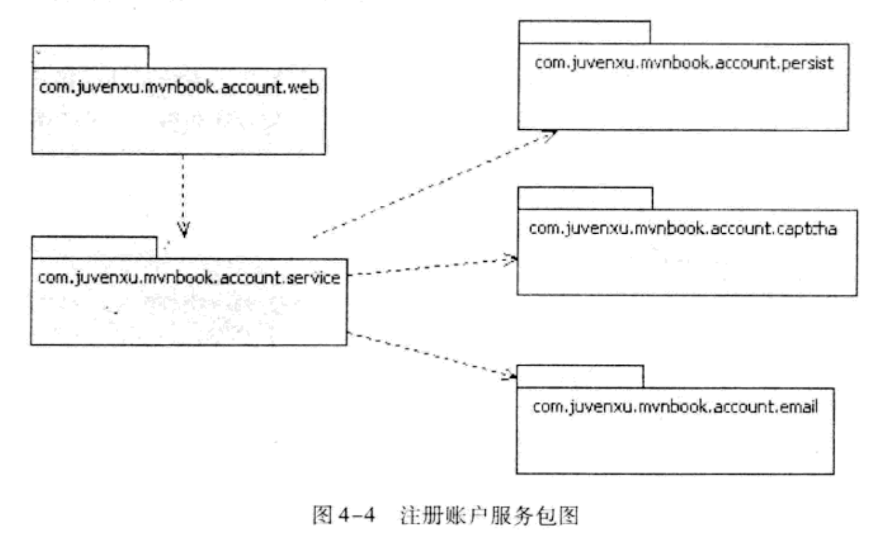
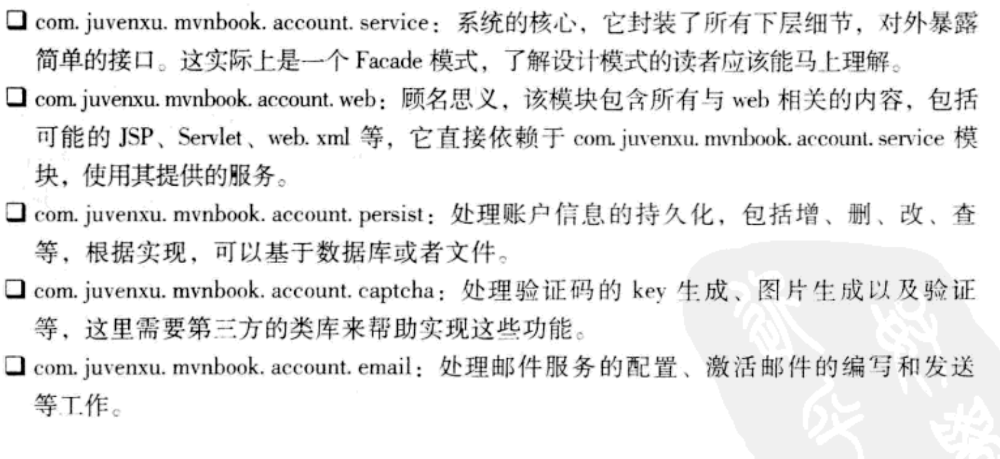
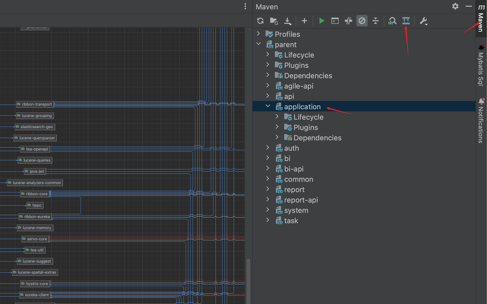
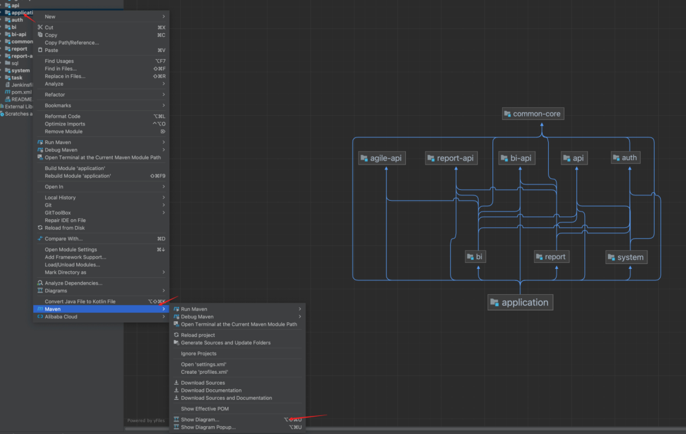
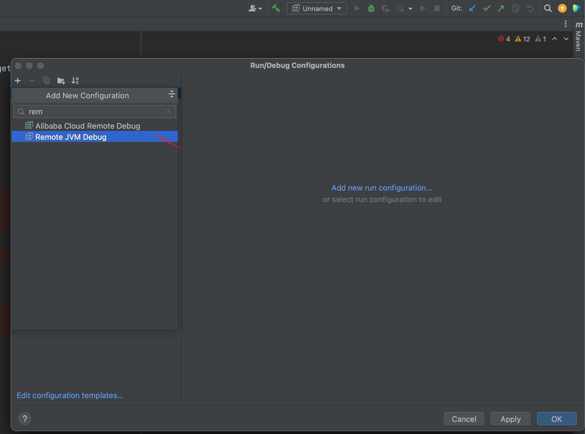
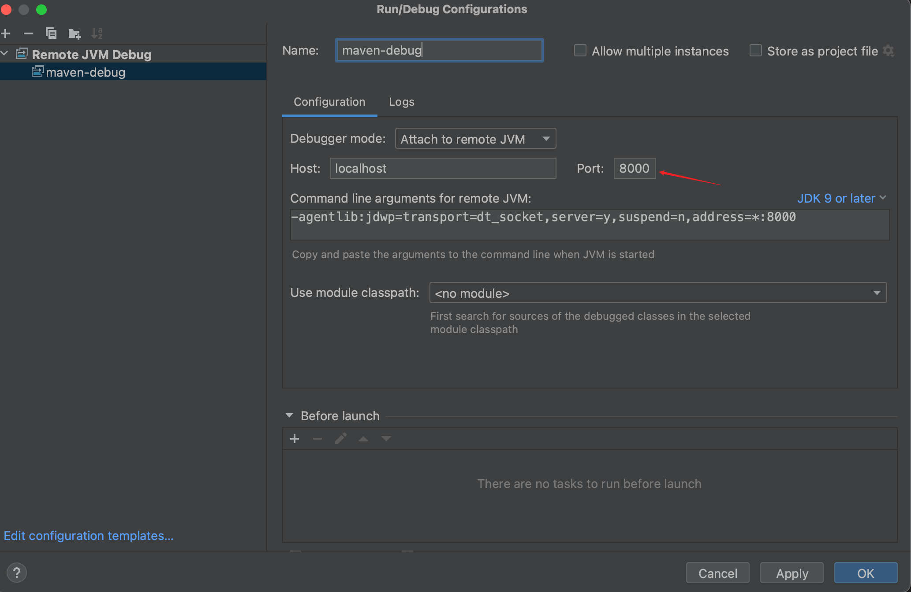
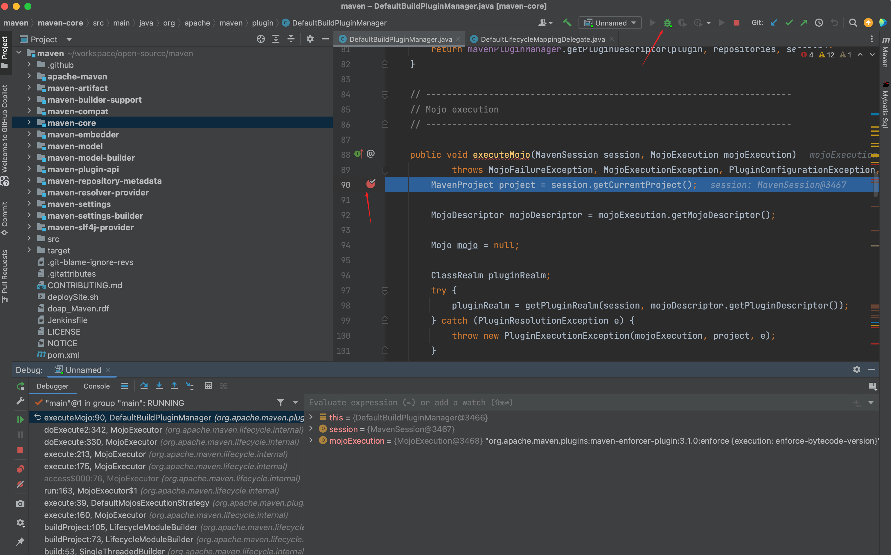
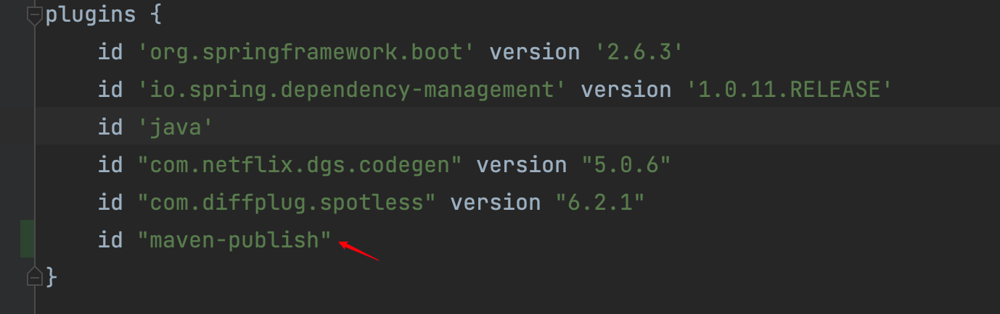
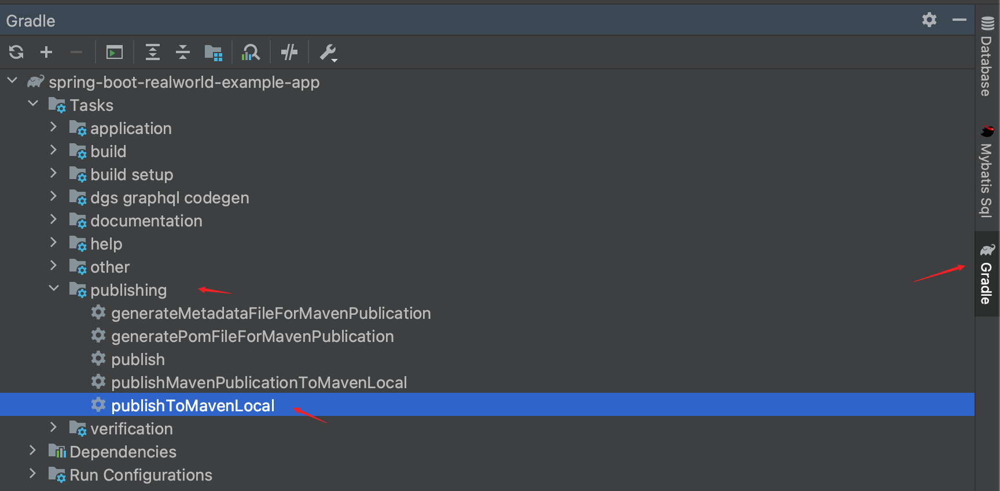
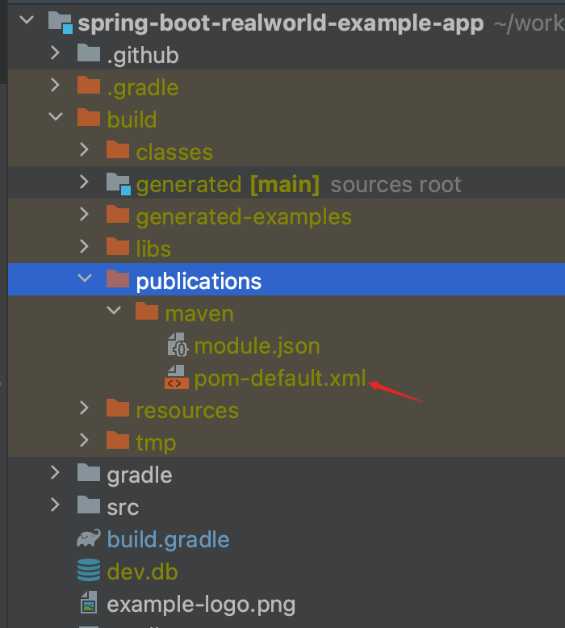

## 博主前言
如果你是一名初级开发工程师, 在架构师制定的规则下CURD, 读此书大有用处, 它会助你高屋建瓴的看清项目
如果你是一名高级开发工程师, 比如说现在的我, 想对项目结构做一些调整优化, 那么此书必读不可. 
此系列是我的读书笔记, 结合实际工作所写, 请享用

## 第1章 Maven简介

何为构建: 从各个网站地方找工具类, 使用工具类写功能代码, 发布到服务器这些过程叫做构建
而maven把这些帮忙干了, 这也是maven的作用/定位

maven还搞了一套文件目录的约定, 让全世界的Java项目都按这套约定走, 减少了人与人之间的学习成本和沟通成本

## 第3章 Maven使用入门

- 默认找的一个环境变量是`JAVA_HOME`, 我的执行的brew 安装的jdk17, maven版本是3.9.1

- 不建议使用IDE自带的, 因为有时会在Terminal中执行一些mvn命令, 自带和本地安装的版本不一样的话, 执行mvn命令和预期的不一样.

- 下载下来的jar包都在`用户根目录/.m2/repository`(约定/默认)中, unix系统就是`~/.m2/repository`

- 安装目录下有bin/conf/lib等一堆文件夹, 其中最重要的是conf中有个setting.xml, 这是整个maven的配置文件. 想要自定义一些配置, 最佳实践是copy到`~/.m2`后再改

### pom.xml介绍

pom.xml分三个部分，定义本工程的坐标、工程所依赖的jar包、打包运行方式。

```xml
<?xml version="1.0" encoding="UTF-8"?>
<project xmlns="http://maven.apache.org/POM/4.0.0"
         xmlns:xsi="http://www.w3.org/2001/XMLSchema-instance"
         xsi:schemaLocation="http://maven.apache.org/POM/4.0.0 http://maven.apache.org/xsd/maven-4.0.0.xsd">
    <modelVersion>4.0.0</modelVersion>
    <groupId>com.lijilei.dept</groupId>
    <artifactId>hello-world</artifactId>
    <version>1.0-SNAPSHOT</version>
  	<packaging>jar</packaging>
  	<name>jilei study maven first project</name>
</project>
```

- <modelVersion> 指定当前 POM 模型的版本，对于 Maven 2 及Maven 3 来说，它只能是4.0.0
- <groupld> 该项目属于**那个公司的哪个组/部门**，google有一个search的项目组，则groupld就应该是`com.google.search`; 本书中的groupld是`com.juvenxu.mvnbook`
- <artifactld>**部门中产品名/项目名**, 这次的项目名叫`hello-world`
- <version> 项目当前的版本, `SNAPSHOT`意为快照，说明该项目还处于开发中/不稳定的版本. 稳定的叫`1.0`(不加snapshot)
- <name> 非必须, 用于声明一个对于用户更为友好的项目名称, 便于交流
- <packaging>非必须, 打包的格式jar/war/pom, 默认jar


### 写代码/测试/打包/发布

目录结构

	├─src
	│  ├─main
	│  │  ├─java   
	│  │  └─resources
	│  └─test
	│      ├─java
	|  		 └─resources
	│--pom.xml


```java
package com.lijilei.dept;

public class HelloWorld {
    public static void main(String[] args) {
        System.out.println(new HelloWorld().sayHello());
    }

    public String sayHello() {
        return "Hello world!";
    }
}
```

`mvn clean compile`

- clean 删除target目录
- compile 生成新的target目录, 代码在`target/classes/com/lijilei/dept/HelloWorld.class`

**编写测试代码**

导入junit包, 这个作者不按套路出牌, 它的groupId不是`com.domain.group`, 但这种写法其实也是允许的

```xml
<dependencies>
    <dependency>
        <groupId>junit</groupId>
        <artifactId>junit</artifactId>
        <version>4.7</version>
        <scope>test</scope>
    </dependency>
</dependencies>
```

- <scope> 意思: 范围, 领域; default is compile
  声明test表示该依赖只对测试有效, 在测试类中可以import junit, 在主类中引入不到该依赖.
  试了一下**在主类中引入提示需要引入该jar**

```java
package com.lijilei.dept;

import org.junit.Test;
import static org.junit.Assert.assertEquals;

public class HelloWorldTest {
    @Test
    public void testSayHello() {
        String result = new HelloWorld().sayHello();
        assertEquals("Hello world!", result);
    }
}
```

- class name: 被测试的类名+Test
- method name: test + 被测试的method name
- 有意思的是: `new HelloWorld`居然不用improt该类, 虽然在IDE中看着是两个文件夹, 但其实编译后是在一块的(同路径)

- 执行测试: `mvn clean test`
- **打包**在target文件夹下生成hello-word-1.0-SNAPSHOT.jar(项目名-版本号): `mvn clean package`
- **发布**: 让别的项目能引到该jar: `mvn clean install`
  就是把jar放到了` ~/.m2/repository/com/lijilei/dept/hello-world/1.0-SNAPSHOT/hello-world-1.0-SNAPSHOT.jar`

**根据脚手架快速生成项目**
就是帮你建好maven指定的目录结构
`mvn archetype:generate`
然后开始填想要的domain, 项目名就行了


## 第5章 坐标和依赖





```xml
<dependencies>
	<dependency>
  	<groupId>com.lijilei.dept</groupId>
    <artifactId>hello-world</artifactId>
    <version>1.0-SNAPSHOT</version>
		<scope></scope> jar包生效的范围, 默认compile
    <optional>true</optional> // 是否可选true/false, 比如说同时准备两种数据库的链接包, 但最佳实践是各建一个maven项目
    <exclusions> // 排除那些传递性依赖
    	<exclusion>
      	<groupId></groupId>
        <artifactId></artifactId>
      </exclusion>
      ......
    </exclusions>
  </dependency>
</dependencies>
```


### scope

mvn中内部有三套classpath在用, 分别是 compile classpath, test classpath, run classpath, 分别对应三套生命周期加载那些jar包

scope就是在控制导入的依赖在那个classpath生效

- compile: 默认, 在三套classpath都有效
- test, 只对测试包有效, 编译`mvn compile`和运行时都无法使用该依赖
  例: junit测试框架, 只需要测试阶段执行就ok, 别的情况不需要
- provided, 对compile和test有效.
  例: servlet-api编译和测试时需要该依赖，但在运行项目的时候，由于tomcat容器已经提供就不需要了
- runtime, 对于测试和运行有效
  例:JDBC驱动的实现，项目只需要编译JDK提供的 JDBC 接口，测试或运行时候才需要真正加载该jar包

### 传递性依赖

项目导入了spring包, maven就会把spring包中用的依赖core/common/web等自动导入到项目中.
项目直接依赖(第一依赖)于spring包, 第二依赖于core/common/web


**依赖冲突**

A -> B -> C -> X-1.0
A -> D -> X-2.0
传递依赖导入了X的不同版本, 使用路径短的,即`a-d-x-2.0`

A -> B -> X-1.0
A -> D -> X-2.0
路径长度相同的, pom中那个在前用那个


### 排除依赖

- 不想用该jar中的某个传递的依赖, 可以写多个<exclusion>

- <exclusion>中只需要groupId和artifactId就可以唯一确定, 因为只会有一个jar, 不同版本会被"解决"掉

```xml
    <exclusions> // 排除那些传递性依赖
    	<exclusion>
      	<groupId></groupId>
        <artifactId></artifactId>
      </exclusion>
      ......
    </exclusions>
```


### 归类依赖

spring的common/core/web全家桶会同时升版本, 抽取出来一个版本号变量

```xml
< properties > 
  <springframework.version>2.5.6</springframework.version>
</properties > 


<dependencies>
	<dependency>
  	< groupid> org. spring framework </groupId >
    <artifactId>spring-core</artifactId>
    <version>${springframework.version}</version>
  </dependency>
  	<dependency>
  	< groupid> org. spring framework </groupId >
    <artifactId>spring-beans</artifactId>
    <version>${springframework.version}</version>
  </dependency>
</dependencies>
```


## 第7章 生命周期和插件

- 三套生命周期各自独立: clean, default, site
- 单独一条生命周期上, 都会把之前的节点执行一遍


**clean**

- pre-clean 执行一些清理前需要完成的工作。

- clean 清理上一次构建生成的文件。

- post-clean 执行一些清理后需要完成的工作。

**defaut**

- validate
- compile 编译`src/main/java`目录下的Java文件至target文件夹

- test
- package 生成jar包
- verify
- install 把生成的jar部署到本地repo


`mvn clean` 执行的是clean周期中的pre-clean和clean

`mvn test` 执行default周期的至test阶段

`mvn clean install` 两个生命周期, clean的clean节点, default的install节点


### 插件build

- 插件和生命周期强绑定, 生命周期只是概念, 插件才是实现

- 一个插件可以有多个目标(功能) , 可以通过命令行使用, 也可以通过配置在pom.xml中**全局生效**

  - 命令行使用: `mvn dependency:tree` 使用dependency插件的tree功能

  - 全局生效: 
    在 POM 中配置插件时，如果该插件是 Maven 的官方插件（即groupld 为org.apache.maven.plugins)，就可以省略<groupId>
  
     ```xml
      <build>
      	<plugins >
      		<plugin>
            <groupId>xxx</groupId>
      			 <artifactId> maven-compiler-plugin</artifactid>
      			 <version>2.1 </version>
      			 <configuration>
      					<source>1.5 /source>
      					<target>1.5</target >
      			</configuration >
      		< /plugin>
      	< /plugins >
      < /build>
     ```


### 真实项目

This is a Spring Boot project that requires packaging the module into a JAR file. 
Spring Boot can create an executable JAR that contains the embedded Tomcat server. 
However, without the appropriate `<plugin>`, it won't generate the standard JAR file.
So `<build>` of maven is very important!

```xml
<build>
    <plugins>
        <plugin>
            <groupId>org.springframework.boot</groupId>
            <artifactId>spring-boot-maven-plugin</artifactId>
            <version>2.5.3</version>
            <executions>
                <execution>
                    <goals>
                        <goal>repackage</goal>
                    </goals>
                </execution>
            </executions>
        </plugin>
    </plugins>
</build>
```


## 第8章 聚合与继承

子模块默认会导入父模块的所有依赖<dependencys>, 而有时候只想用其中一部分, 则用<dependencyManagement>在父模块包裹一层, 子模块只有明确声明时才会引入.

```xml
<dependencyManagement>
    <dependencies>
      <dependency>
          <groupId>com.alibaba</groupId>
          <artifactId>fastjson</artifactId>
          <version>1.0</version>
      </dependency>
 	 </dependencies>
</dependencyManagement>
```


**使用SpringBoot**

创建SpringBoot项目时, 自己项目在分多模块, SpringBoot本身也有自己的依赖要用,这时候就**需要导入**RedHat工程师给SpringBoot声明的一大堆<dependencyMangement> 
用的时候, 子模块直接导入`spring-boot-starter-web`就行了, 父模块不需要重复声明

- <type>pom</type> is 固定写法, 说明是依赖是个pom工程(没有实际代码)
  - scope=import说明要导入,但只导入声明不真正导入所有jar包
    import只能用在<dependencyMangement>下的type=pom中
  - 不加import, 则真导入所有jar包

```xml
<dependencyManagement>
    <dependencies>
        <dependency>
            <groupId>org.springframework.boot</groupId>
            <artifactId>spring-boot-dependencies</artifactId>
            <version>2.12</version>
            <type>pom</type>
            <scope>import</scope>
        </dependency>
  </dependencies>
</dependencyManagement>
```


### 父模块

- 声明必须必有的groupId, artifactId, version等等
- 使用<dependencyMangement> 来声明引入那些jar包, 各用什么版本

- <modules> <module> 声明有什么子模块, 声明名就是compile是的顺序

- <packaging>是pom

```xml
<?xml version="1.0" encoding="UTF-8"?>
<project xmlns="http://maven.apache.org/POM/4.0.0"
         xmlns:xsi="http://www.w3.org/2001/XMLSchema-instance"
         xsi:schemaLocation="http://maven.apache.org/POM/4.0.0 http://maven.apache.org/xsd/maven-4.0.0.xsd">
    <modelVersion>4.0.0</modelVersion>
    <groupId>com.sjky.deepbi</groupId>
    <artifactId>parent</artifactId>
    <packaging>pom</packaging>
    <version>1.0-SNAPSHOT</version>
  
    <modules>
        <module>bi</module>
        <module>common</module>
        <module>application</module>
        <module>task</module>
    </modules>
    
    <properties>
        <spring-boot.version>2.3.12.RELEASE</spring-boot.version>
	      <fastjson.version>1.2.76</fastjson.version>
    </properties>

    <dependencyManagement>
        <dependencies>
            <!-- SpringBoot 依赖配置 -->
            <dependency>
                <groupId>org.springframework.boot</groupId>
                <artifactId>spring-boot-dependencies</artifactId>
                <version>${spring-boot.version}</version>
                <type>pom</type>
                <scope>import</scope>
            </dependency>

            <!-- fastjson 序列化 -->
            <dependency>
                <groupId>com.alibaba</groupId>
                <artifactId>fastjson</artifactId>
                <version>${fastjson.version}</version>
            </dependency>
        </dependencies>
    </dependencyManagement>
		# 全部的子模块都会继承
    <dependencies>
        <dependency>
            <groupId>org.projectlombok</groupId>
            <artifactId>lombok</artifactId>
            <scope>provided</scope>
        </dependency>
    </dependencies>

    <build>
        <pluginManagement>
          <plugins>
                <plugin>
                    <groupId>org.springframework.boot</groupId>
                    <artifactId>spring-boot-maven-plugin</artifactId>
                    <version>2.5.3</version>
                </plugin>
          </plugins>
        </pluginManagement>
    </build>
      
</project>
```


### 子模块

- <parent>引入父模块的三要素groupId, artifactId, version
- groupId和version就都遵循父模块的了, 只需要声明自己的名字即可artifactId
- 引入自己用的依赖, 只需要写groupId和artifactId

```xml
<?xml version="1.0" encoding="UTF-8"?>
<project xmlns="http://maven.apache.org/POM/4.0.0"
         xmlns:xsi="http://www.w3.org/2001/XMLSchema-instance"
         xsi:schemaLocation="http://maven.apache.org/POM/4.0.0 http://maven.apache.org/xsd/maven-4.0.0.xsd">
    <modelVersion>4.0.0</modelVersion>
	  <parent>
        <groupId>com.sjky.deepbi</groupId>
        <artifactId>parent</artifactId>
        <version>1.0-SNAPSHOT</version>
    </parent>

    <artifactId>bi</artifactId>

    <dependencies>
        <dependency>
            <groupId>org.springframework.boot</groupId>
            <artifactId>spring-boot-starter-web</artifactId>
        </dependency>

        <dependency>
            <groupId>com.tangzc</groupId>
            <artifactId>mybatis-plus-ext-boot-starter</artifactId>
        </dependency>
      
        <dependency>
            <groupId>com.alibaba</groupId>
            <artifactId>fastjson</artifactId>
        </dependency>

        <dependency>
            <groupId>com.sjky.deepbi</groupId>
            <artifactId>common-core</artifactId>
            <version>${project.version}</version> // 点一下是顶部的parent.version
        </dependency>
    </dependencies>

</project>
```


**查看maven导入的依赖关系图**

- 侧边栏maven -> 选中某个项目 -> showDependeny
- command + F 可以搜索jar名
- 红色实线表示冲突，红色虚线表示多处引用
- 点击线可以高亮显示



**查看多模块项目的依赖关系**




## 给maven改bug

```sh
# 从github上拉取代码

# 查看发过的版本, 我电脑装的是3.9.1
git tag

git checkout maven-3.9.1

# idea 打开maven项目, 在根目录(pom.xml在的目录)
# mvnDebug是maven安装包中bin下的一个能力, 另一个能力是mvn.
# 提示请监听8000端口
➜  maven git:(maven-3.9.1) mvnDebug compile
Preparing to execute Maven in debug mode
Listening for transport dt_socket at address: 8000
```


**idea配置连接远程JVM**







**侧边栏打断点, 右上方debug按钮, 就能打到断点处了**




**不正确的地方执行mvnDebug compile**

```sh
➜  bin git:(stable) mvnDebug compile
Preparing to execute Maven in debug mode
Listening for transport dt_socket at address: 8000
[INFO] Scanning for projects...
[INFO] ------------------------------------------------------------------------
[INFO] BUILD FAILURE
[INFO] ------------------------------------------------------------------------
[INFO] Total time:  0.039 s
[INFO] Finished at: 2023-12-11T16:26:38+08:00
[INFO] ------------------------------------------------------------------------
# 重点 ============================ 执行的文件夹没有pom文件
[ERROR] The goal you specified requires a project to execute but there is no POM in this directory (/opt/homebrew/Cellar/maven/3.9.1/libexec/bin). Please verify you invoked Maven from the correct directory. -> [Help 1]
[ERROR]
[ERROR] To see the full stack trace of the errors, re-run Maven with the -e switch.
[ERROR] Re-run Maven using the -X switch to enable full debug logging.
[ERROR]
[ERROR] For more information about the errors and possible solutions, please read the following articles:
[ERROR] [Help 1] http://cwiki.apache.org/confluence/display/MAVEN/MissingProjectException
```


## gradle to maven

查看gradle版本 `gradle --version`

```sh
(base) ➜  ~ gradle --version

------------------------------------------------------------
Gradle 8.5
------------------------------------------------------------

Build time:   2023-11-29 14:08:57 UTC
Revision:     28aca86a7180baa17117e0e5ba01d8ea9feca598

Kotlin:       1.9.20
Groovy:       3.0.17
Ant:          Apache Ant(TM) version 1.10.13 compiled on January 4 2023
JVM:          17.0.6 (Oracle Corporation 17.0.6+9-LTS-190)
OS:           Mac OS X 14.2.1 aarch64
```

### generate pom.xml

下了个一个`realworld-example`的项目, 构建工具是gradle, 对gradle并不熟, 所以想把它转为maven项目.

gradle在7及以后换了转maven的方式, 在此只记录7之后的.

在build.gradle文件中, plugins模块下加这个一个plugin: `id "maven-publish"`




在build.gradle文件中, 最后加这个一些代码, 这样生成的<groupId><artifacId>就是pom中写入的

```groovy

publishing {
    publications {
        maven(MavenPublication) {
            groupId = 'org.gradle.sample'
            artifactId = 'library'
            version = '1.1'

            from components.java
        }
    }
}
```

刷新gradle后, 在右侧工具栏中找到这个任务执行



然后在左侧build输出文件的这个位置就能看到生成的`pom`文件了, 另外该pom.xml也在`~/.m2/repository/org/gradle/sample/library/1.1/library-1.1.pom`路径下有一份




复制个新项目, 相处gradle相关的配置, 把pom复制到对应目录, 新开/导入该项目


### modify pom.xml

In `build.gradle` file , have lombok, junit4, mybatis-test, but general pom.xml have no somethings, and everyone <scope> is runtime!

生成的pom.xml中的<packaging>类型是`pom`, 需要改过来
所有的依赖<scope>都是`runtime`, 需要删掉了

```groovy
# build.gradle
dependencies {
	  // lombok
    compileOnly 'org.projectlombok:lombok'

  	// test need 
    testImplementation 'io.rest-assured:rest-assured:3.1.1'
    testImplementation 'io.rest-assured:spring-mock-mvc:3.1.1'
    testImplementation 'org.springframework.boot:spring-boot-starter-test'
    testImplementation 'org.mybatis.spring.boot:mybatis-spring-boot-starter-test:2.1.3'
}
```

```xml
  <modelVersion>4.0.0</modelVersion>
  <groupId>org.gradle.sample</groupId>
  <artifactId>library</artifactId>
  <version>1.1</version>
  <packaging>pom</packaging>    ## error: pom  
  <dependencies>
    <dependency>
      <groupId>org.springframework.boot</groupId>
      <artifactId>spring-boot-starter-web</artifactId>
      <scope>runtime</scope>  ## error: runtime
    </dependency>
    <dependency>
      <groupId>org.springframework.boot</groupId>
      <artifactId>spring-boot-starter-validation</artifactId>
      <scope>runtime</scope>
    </dependency>
```


