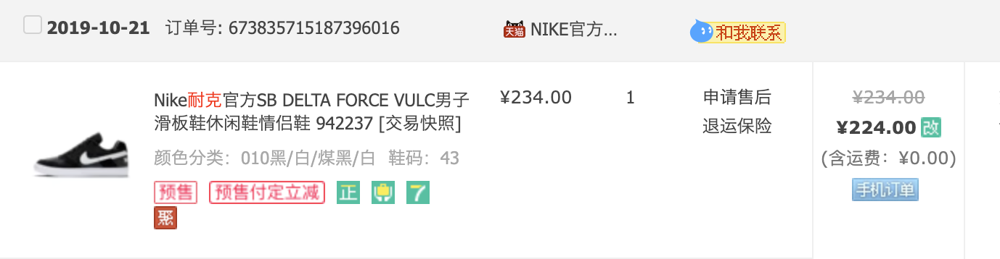
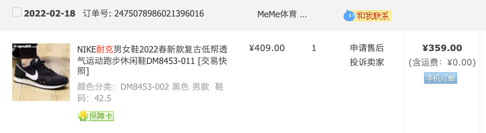
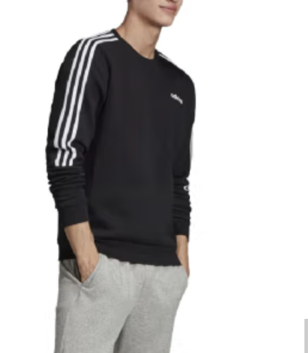
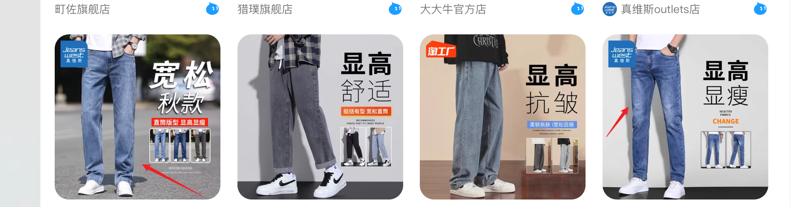
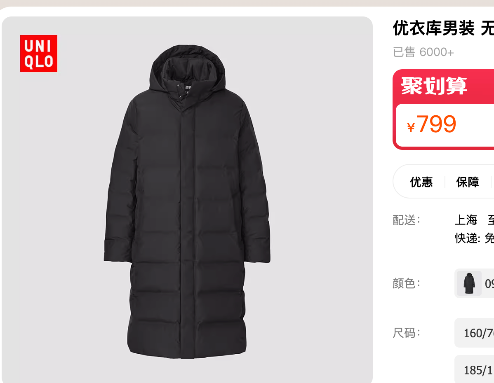

最近天气变冷, 正好是一个更换衣物的机会, 写一下我的建议

**品牌:** 耐克, 阿迪, 先从这两家选就行. 不要选国产品牌回力/李宁/安踏.

**什么款式:** 黑白为主色调, 买前两年的老款. 但老款不等于过时. 选黑白的, 不会有过时之说 

**购买方式:** 网购, 不要去店里, 因为就算是奥特莱斯也是换季处理库存时便宜

**网购优点:** 可以退换货, 并且可以买到以前的老款. 老款才便宜

**正品?:**  优先考虑官方旗舰店, 但这种里面一般找不到便宜的. 只要淘宝店等级是皇冠, 评价在4.7/4.8的都ok. 这种店为了长久经营不会卖假货的

**买什么:** 
城市四季没那么分明, 冬天走到哪都是暖气, 出门就是公交

- 鞋, 一双鞋我穿春夏秋三季
- 短袖(便宜可以顺带买上), 在城市里冬天也能穿短袖
- 卫衣(不要带帽子),  少买毛衣(毛衣便宜的很low). 卫衣可以穿春/秋/冬三季
- 褂子(不要炫彩的). 能接受冲锋衣吗, 我的迪卡侬冲锋衣穿了也3/4年了, 还被人吐槽像工人, 不过还能再穿3/4年.
- 裤子我认为耐克阿迪不怎么适合, 咱俩一样的迪卡侬运动裤就行, 再买买经典款牛仔裤就行(不要带洞), 说两个品牌吧, 森马,海澜之家
- 羽绒服不急买

**价格:** 200元左右一件. 羽绒服不要低于500. 冲锋衣不要低于300

19年买的, 4年了, 我现在还在穿, 感觉还能再穿4年, 200多一点

和你姐我俩一样的, 我们买时已经是老款了360. 但后来我们第二年又看, 降成260了

阿迪的, 199元, 这种款式就是10年前在卖, 10年后还会在卖

牛仔裤就1/4这种正常的经典的浅蓝色. 不要搞烂七八糟的颜色, 找个大品牌买就行. 森马/海澜之家

外套, 建议冲锋衣. 可以穿春/冬/秋三季, 冬天不买羽绒服都可以. 

我的羽绒服是优衣库的, 这种, 保守估计, 可以穿10年. 20岁的人在穿, 30岁的人也在穿, 40岁的人更能穿了

