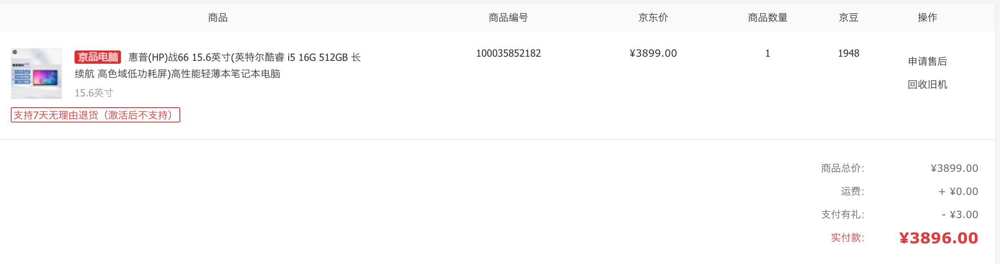
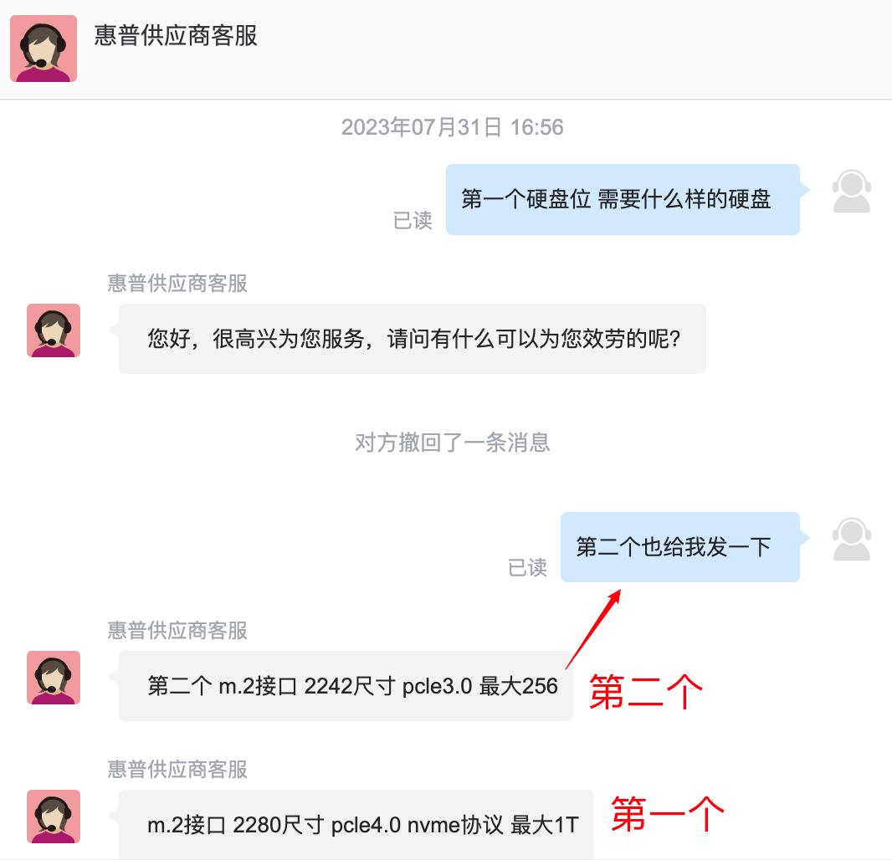
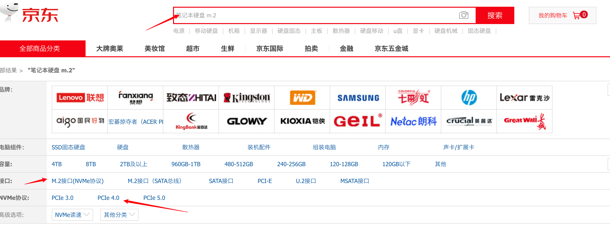
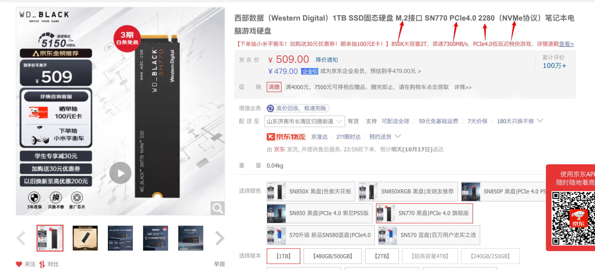
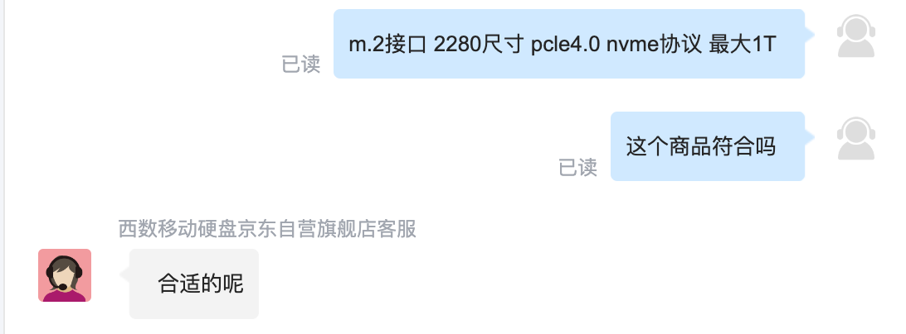
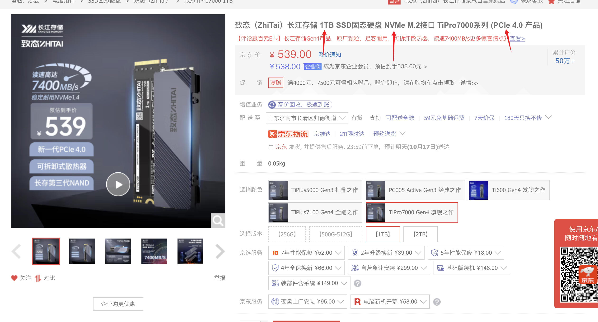
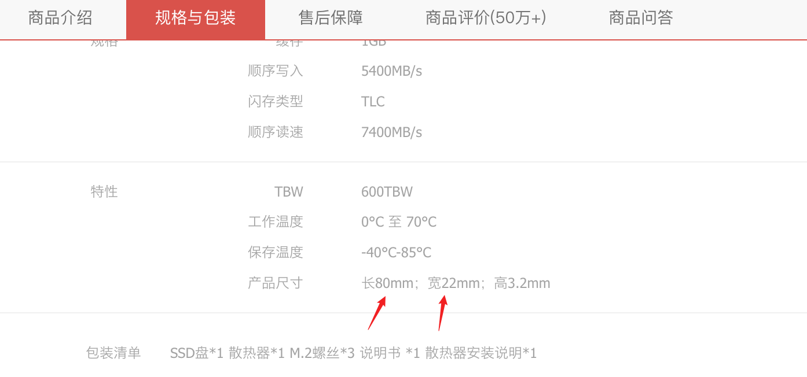

首先明确一下概念, 这个事我说了不止一次了, 你需要把这个文档存下来, 背一下, 打字写几遍, 说错了显得很low.

你电脑的内存是16G, 一般称为**内存**; "运行内存"是标准叫法, 更换时叫: **换内存条**.

512G的那个一般称为**硬盘**; 分机械硬盘和固态硬盘, "固态"现在也代指硬盘.更换时叫: **换硬盘**.

手机叫法很乱, 手机怎么喊咱不管, 但和人沟通时用到电脑上的不要错!

## 有问题找谁

**购买地址(已下架)**: https://item.jd.com/100035852182.html

**订单号:**  273463164627
**订单详情:** 

**把订单号/具体型号甩给他**

## 硬盘

**主接口**: m.2接口 2280尺寸 pcle4.0 nvme协议 最大1T

**扩展接口**:m.2接口 2242尺寸 pcle3.0 nvme协议 最大256

**品牌**: 西部数据, 三星, 金士顿等等销量高的

**注意:** 换主硬盘得重装系统, 谨慎
建议你买个扩展接口适用的256的, 正常工作中1T一般用不到~

**举例: 搜索主接口. 我是这样搜的, 再选择上下方的选项**

点进去看了看标题, 然后再找客服确认一下

https://item.jd.com/100019517363.html#crumb-wrap

又点开一个, 这个没我没问客服, 看下方参数应该也是2280

https://item.jd.com/100017474683.html#crumb-wrap

## 内存

想让电脑发挥最大性能需要放进来去两个一模一样的内存条.
内存条分笔记本用和台式机用, 专门强调一下要买笔记本用的. 

你现在是16G, 由两个8G的内存条构成

最大支持32G, 需要由两个16G的内存条构成

